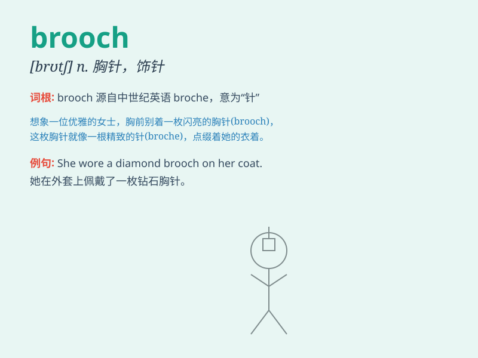

## brooch

**英音:** _[brəʊtʃ]_ **美音:** _[brotʃ]_

**译义:** *n.胸针,领针*

### 短语

+ **gold brooch:** _金胸针_

+ **pearl brooch:** _珍珠胸针_

+ **antique brooch:** _古董胸针_

+ **ornate brooch:** _华丽的胸针_

+ **diamond brooch:** _钻石胸针_

### 例句

#### 例句1

> **She wore a beautiful brooch on her dress.**

**中文翻译:** 她在她的连衣裙上戴了一枚漂亮的胸针。

**单词释义:** 胸针

#### 例句2

> **The antique brooch was passed down through generations.**

**中文翻译:** 这枚古董胸针代代相传。

**单词释义:** 胸针

#### 例句3

> **He gave her a diamond brooch as a gift.**

**中文翻译:** 他送给她一枚钻石胸针作为礼物。

**单词释义:** 胸针

### 背诵小故事

> A princess was attending a grand ball. But her dress seemed plain.
Then, a fairy appeared and gave her a beautiful brooch. With the brooch,
she became the most charming one at the ball.

**一位公主正在参加盛大的舞会。但她的裙子看起来很普通。然后，一位仙女出现了，并给了她一枚漂亮的胸针。有了这枚胸针，她成为了舞会上最迷人的人。**

### 图义

