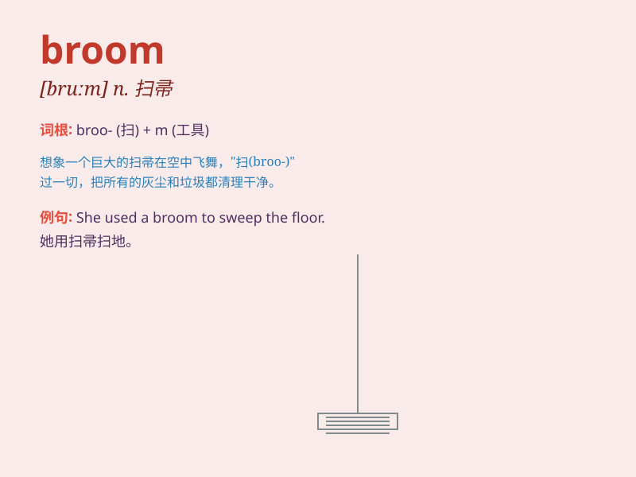

## broom

**英音:** _[bruːm]_ **美音:** _[brum]_

**译义:** *n.扫帚,[植]金雀花vt.扫除*

### 短语

+ **broom closet:** _清洁用具壁橱_

+ **new broom:** _新上任者；新官_

+ **broom handle:** _扫帚柄_

+ **push the broom:** _扫地；做清洁工作_

+ **fly on a broom:** _骑扫帚飞行（常指女巫）_

### 例句

#### 例句1

> **She swept the floor with a broom.**

**中文翻译:** 她用扫帚扫地。

**单词释义:** 扫帚

#### 例句2

> **The witch rides on a broom in the story.**

**中文翻译:** 在故事中，女巫骑着扫帚。

**单词释义:** 扫帚

#### 例句3

> **He leaned the broom against the wall.**

**中文翻译:** 他把扫帚靠在墙上。

**单词释义:** 扫帚

### 背诵小故事

> One day, a little witch was flying on her broom. Suddenly, a strong
wind blew and the broom started to wobble. But the witch held on tight
and continued her magical journey.

**有一天，一个小女巫骑着她的扫帚在飞行。突然，一阵强风吹来，扫帚开始摇晃。但女巫紧紧抓住，继续她的神奇之旅。**

### 图义

