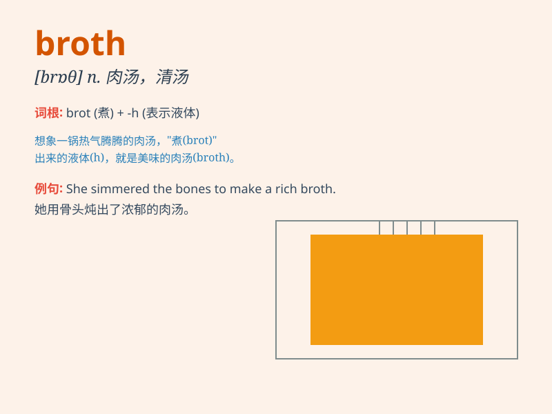

## broth

**英音:** _[brɒθ]_ **美音:** _[brɑθ]_

**译义:** *n.肉汤*

### 短语

+ **chicken broth:** _鸡汤_

+ **beef broth:** _牛肉汤_

+ **vegetable broth:** _蔬菜汤_

+ **clear broth:** _清汤_

+ **thick broth:** _浓汤_

### 例句

#### 例句1

> **The chef added some vegetables to the broth to enhance the
flavor.**

**中文翻译:** 厨师往肉汤里加了一些蔬菜来提味。

**单词释义:** 肉汤

#### 例句2

> **She sipped the hot broth carefully.**

**中文翻译:** 她小心地啜饮着热肉汤。

**单词释义:** 肉汤

#### 例句3

> **The broth was too salty for my taste.**

**中文翻译:** 这肉汤对我来说太咸了。

**单词释义:** 肉汤

### 背诵小故事

> A poor boy was very hungry. A kind cook gave him a bowl of warm
broth. The boy felt so good after drinking it. The broth saved him from
starving.

**一个可怜的男孩非常饥饿。一位善良的厨师给了他一碗温热的肉汤。男孩喝完后感觉非常好。这碗肉汤让他免于挨饿。**

### 图义

