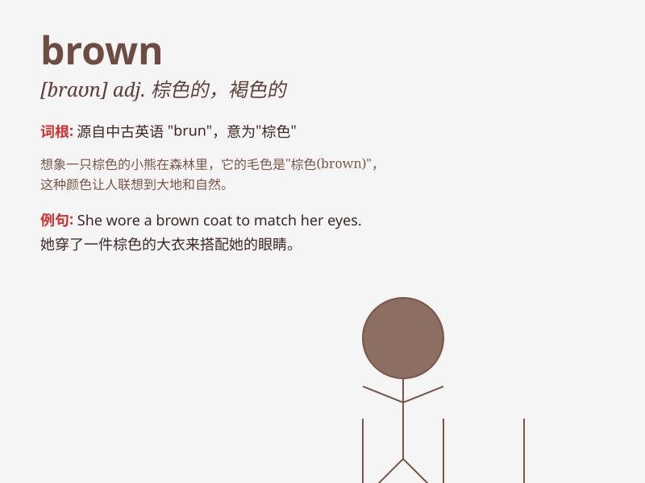

## brown

**英音:** _[braʊn]_ **美音:** _[braʊn]_

**译义:** *n.褐色adj.褐色的,棕色的v.(使)成褐色,晒黑*

### 短语

+ **brown bread:** _黑面包_

+ **brown eyes:** _棕色的眼睛_

+ **brown sugar:** _红糖_

+ **brown paper:** _牛皮纸_

+ **brown bear:** _棕熊_

### 例句

#### 例句1

> **The dog has brown fur.**

**中文翻译:** 这只狗有棕色的皮毛。

**单词释义:** 棕色的

#### 例句2

> **She wore a brown dress to the party.**

**中文翻译:** 她穿着一件棕色连衣裙去参加聚会。

**单词释义:** 棕色的

#### 例句3

> **His eyes are brown.**

**中文翻译:** 他的眼睛是棕色的。

**单词释义:** 棕色的

### 背诵小故事

> One day, a little bear was walking in the forest. Its fur was brown.
It saw a brown tree trunk and thought it was a friend. It hugged the
trunk and had a great time. The brown color made the bear feel warm and
safe.

**有一天，一只小熊在森林里散步。它的皮毛是棕色的。它看到一根棕色的树干，还以为是朋友。它抱住树干，玩得很开心。棕色让小熊感到温暖和安全。**

### 图义

