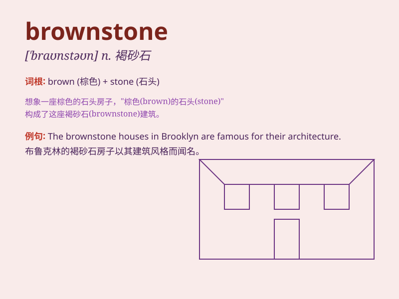

## brownstone

**英音:** _[\'braʊnstəʊn]_ **美音:** _[\'braʊn\'ston]_

**译义:** *n.褐色砂石,赤褐色砂石建筑adj.上流社会的,富有阶级的*

### 短语

+ **brownstone front:** _褐石正面_

+ **brownstone district:** _褐石区_

+ **brownstone building:** _褐石建筑_

+ **brownstone facade:** _褐石立面_

+ **brownstone townhouse:** _褐石联排别墅_

### 例句

#### 例句1

> **The old brownstone building has a lot of charm.**

**中文翻译:** 古老的褐砂石建筑很有魅力。

**单词释义:** 褐砂石

#### 例句2

> **They live in a beautiful brownstone on the corner.**

**中文翻译:** 他们住在街角一栋美丽的褐砂石建筑里。

**单词释义:** 褐砂石（建筑）

#### 例句3

> **The brownstone facade of the house needed some repair.**

**中文翻译:** 房子的褐砂石外墙需要修理一下。

**单词释义:** 褐砂石（材料）

### 背诵小故事

> A young artist was looking for a new home. One day, he found a
beautiful old building made of brownstone. The unique texture and color
of the brownstone charmed him. He decided to move in and create
wonderful art there.

**一位年轻的艺术家正在寻找新家。有一天，他发现了一座由褐石建造的漂亮老建筑。褐石独特的质地和颜色吸引了他。他决定搬进去并在那里创作精彩的艺术。**

### 图义

