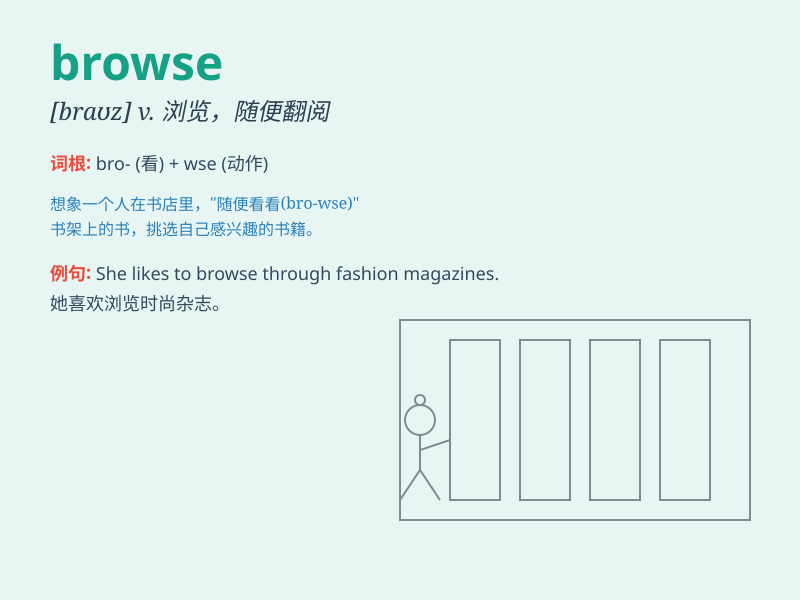

## browse

**英音:** _[braʊz]_ **美音:** _[braʊz]_

**译义:** *v.n.浏览,吃草,放牧*

### 短语

+ **browse through:** _浏览；翻阅_

+ **browse around:** _四处浏览；随便看看_

+ **browse the web:** _浏览网页_

+ **browse the shelves:** _浏览书架_

+ **browse the market:** _逛市场_

### 例句

#### 例句1

> **I like to browse the internet in my free time.**

**中文翻译:** 我喜欢在空闲时间浏览互联网。

**单词释义:** 浏览

#### 例句2

> **She was browsing through the books in the bookstore.**

**中文翻译:** 她正在书店翻阅书籍。

**单词释义:** 随意翻阅；浏览

#### 例句3

> **He spent hours browsing the antiques market.**

**中文翻译:** 他花了几个小时浏览古董市场。

**单词释义:** 逛（市场等）；浏览

### 背诵小故事

> A little girl named Lily loves to browse through books in the
library. One day, she found a magical book while browsing. It opened a
new world for her.

**一个叫莉莉的小女孩喜欢在图书馆里浏览书籍。有一天，她在浏览时发现了一本神奇的书。这为她打开了一个全新的世界。**

### 图义

