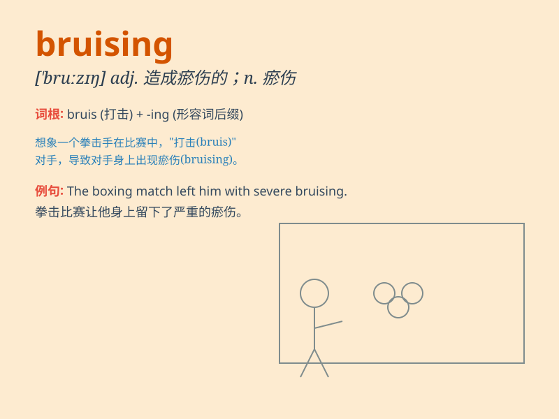

## bruising

**英音:** _[ˈbruːzɪŋ]_ **美音:** _[ˈbruːzɪŋ]_

**译义:** *adj. 令人筋疲力尽的；令人沮丧的；造成瘀伤的 n.
瘀伤；挫伤 v. 使受瘀伤；使受挫伤（bruise 的 ing 形式）*

### 短语

+ **bruising battle:** _激烈的战斗_

+ **bruising encounter:** _激烈的遭遇_

+ **bruising competition:** _激烈的竞争_

+ **bruising experience:** _痛苦的经历_

+ **bruising defeat:** _惨重的失败_

### 例句

#### 例句1

> **The athlete suffered a bruising encounter in the boxing
match.**

**中文翻译:** 这位运动员在拳击比赛中遭遇了一场激烈而残酷的对抗。

**单词释义:** 激烈而残酷的

#### 例句2

> **She had a bruising experience during her first job interview.**

**中文翻译:** 她在第一次工作面试时有一次痛苦的经历。

**单词释义:** 痛苦的

#### 例句3

> **The political campaign was a bruising battle for both
candidates.**

**中文翻译:** 这场政治竞选对两位候选人来说都是一场激烈的争斗。

**单词释义:** 激烈的

### 背诵小故事

> I was playing football and had a bruising encounter with another
player. I fell hard and got bruises on my legs. It was a painful but
memorable experience. Remember, \'bruising\' means causing or getting
bruises.

**我在踢足球时和另一名球员有了一次激烈碰撞。我重重摔倒，腿上有了瘀伤。这是一次痛苦但难忘的经历。记住，\'bruising\'意思是造成瘀伤或有瘀伤。**

### 图义

