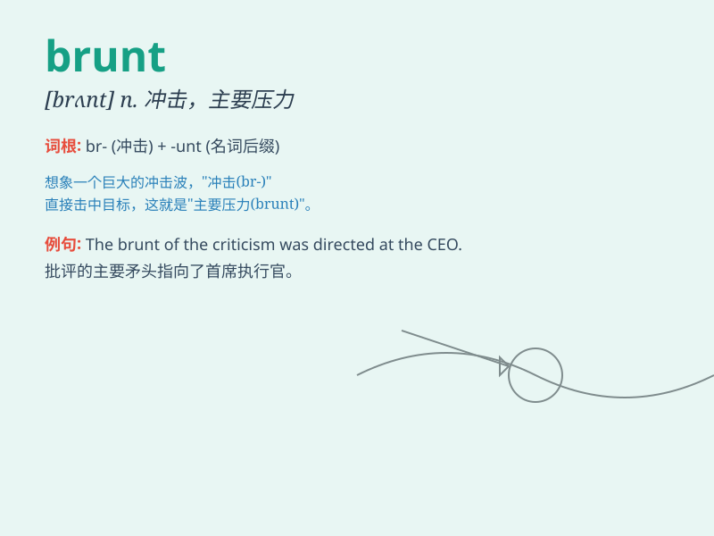

## brunt

**英音:** _[brʌnt]_ **美音:** _[brʌnt]_

**译义:** * n冲击,冲势*

### 短语

+ **bear the brunt:** _承受主要压力；首当其冲_

+ **take the brunt:** _承受冲击；受到主要影响_

+ **the brunt of something:** _某事的主要冲击；某事的主要压力_

+ **be at the brunt:** _处于受冲击的位置_

+ **face the brunt:** _面对主要压力_

### 例句

#### 例句1

> **The army bore the brunt of the attack.**

**中文翻译:** 军队首当其冲。

**单词释义:** 主要压力；首当其冲

#### 例句2

> **Small businesses often have to bear the brunt of economic
downturns.**

**中文翻译:** 小企业往往在经济衰退时首当其冲。

**单词释义:** 主要冲击

#### 例句3

> **She took the brunt of the criticism for the team\'s failure.**

**中文翻译:** 她首当其冲地受到了球队失败的批评。

**单词释义:** 大部分；主要部分

### 背诵小故事

> A brave knight always took the brunt of the enemy\'s attacks to
protect his comrades. One day, in a fierce battle, he faced the brunt
again and emerged victorious. The brunt here means the main force or
impact of something.

**一位勇敢的骑士总是承受敌人攻击的主要力量来保护他的同伴。有一天，在一场激烈的战斗中，他再次承受主要冲击并取得胜利。这里的brunt意思是某事的主要力量或冲击。**

### 图义

