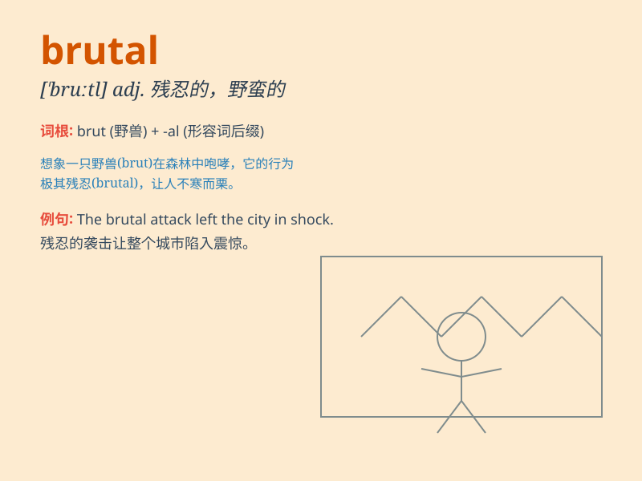

## brutal

**英音:** _[\'bruːt(ə)l]_ **美音:** _[\'brutl]_

**译义:** *adj.残忍的,兽性的*

### 短语

+ **brutal truth:** _残酷的事实_

+ **brutal attack:** _野蛮的攻击_

+ **brutal force:** _暴力；残酷的力量_

+ **brutal murder:** _残忍的谋杀_

+ **brutal treatment:** _粗暴的对待_

### 例句

#### 例句1

> **The brutal winter storm caused widespread power outages.**

**中文翻译:** 残酷的冬季风暴导致大范围停电。

**单词释义:** 残酷的；野蛮的

#### 例句2

> **He delivered a brutal criticism of the new policy.**

**中文翻译:** 他对新政策提出了严厉的批评。

**单词释义:** 严厉的；直率而令人不快的

#### 例句3

> **The boxer\'s style was brutal but effective.**

**中文翻译:** 拳击手的风格虽然残酷但有效。

**单词释义:** 残忍的；粗暴的

### 背诵小故事

> A knight was fighting against a brutal monster. The monster had sharp
teeth and was very fierce. But the brave knight finally defeated it.
\'Brutal\' means cruel and violent, just like that monster.

**一位骑士正在与一只残暴的怪物战斗。这只怪物有着锋利的牙齿，非常凶猛。但勇敢的骑士最终打败了它。'brutal'意思是残忍的、暴力的，就像那只怪物。**

### 图义

