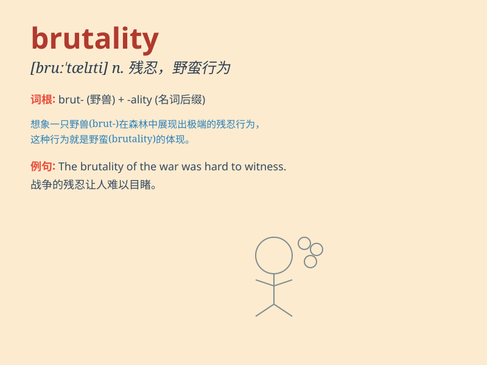

## brutality

**英音:** _[brʊ\'tælɪtɪ]_ **美音:** _[brʊ\'tæləti]_

**译义:** *n.残忍,野蛮的行为*

### 短语

+ **acts of brutality:** _残暴行为_

+ **brutality of war:** _战争的残暴_

+ **endure brutality:** _忍受残暴_

+ **commit brutality:** _犯下暴行_

+ **prevent brutality:** _防止暴行_

### 例句

#### 例句1

> **The brutality of the crime shocked the entire community.**

**中文翻译:** 犯罪之残忍程度震惊了全社会。

**单词释义:** 残暴；残忍；暴虐

#### 例句2

> **He couldn\'t tolerate the brutality of the war.**

**中文翻译:** 他无法忍受战争的残酷。

**单词释义:** 残酷；残忍

#### 例句3

> **The police were accused of brutality during the protest.**

**中文翻译:** 警方被指控在抗议期间实施暴力。

**单词释义:** 粗暴；野蛮

### 背诵小故事

> A brave knight witnessed the brutality of the evil dragon. It burned
villages and hurt innocent people. The knight decided to fight against
this cruelty to protect everyone.

**一位勇敢的骑士目睹了恶龙的残暴。它烧毁村庄，伤害无辜百姓。骑士决定对抗这种残忍行径来保护所有人。**

### 图义

