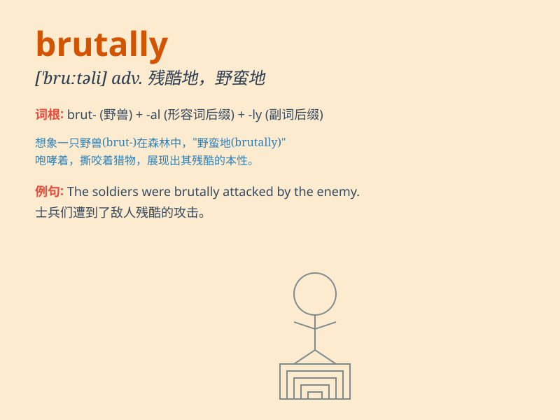

## brutally

**英音:** _[\'bruːtəli]_ **美音:** _[\'bruːtəli]_

**译义:** *adv.兽性地,残酷地*

### 短语

+ **brutally honest:** _极其坦诚的_

+ **brutally cold:** _极其寒冷的_

+ **brutally attacked:** _遭到残酷攻击_

+ **brutally murdered:** _被残忍杀害_

+ **brutally treated:** _受到残酷对待_

### 例句

#### 例句1

> **The enemy brutally attacked the village, killing many innocent
people.**

**中文翻译:** 敌人残酷地袭击了这个村庄，造成许多无辜群众死亡。

**单词释义:** 残忍地

#### 例句2

> **He was brutally honest when he criticized my work.**

**中文翻译:** 当他批评我的工作时，他非常诚实。

**单词释义:** 非常；极端

#### 例句3

> **The dictator ruled the country brutally for many years.**

**中文翻译:** 独裁者残酷统治这个国家多年。

**单词释义:** 残暴地

### 背诵小故事

> A brave detective was investigating a crime. The criminal acted
brutally, hitting the victim without mercy. But the detective was
determined to catch the criminal and bring justice.

**一位勇敢的侦探正在调查一起犯罪案件。罪犯的行为极其残忍，毫不留情地殴打受害者。但侦探决心抓住罪犯，伸张正义。**

### 图义

