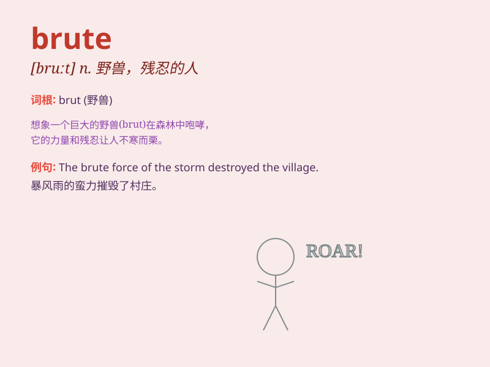

## brute

**英音:** _[bruːt]_ **美音:** _[brut]_

**译义:** *adj.残忍的,畜生般的n.残忍的人,畜生*

### 短语

+ **brute force:** _暴力；强力；蛮干_

+ **brute fact:** _赤裸裸的事实_

+ **brute nature:** _兽性；残忍的本性_

+ **brute strength:** _蛮力；强大的力量_

+ **brute animal:** _野兽；未驯化的动物_

### 例句

#### 例句1

> **The brute force of the storm destroyed many houses.**

**中文翻译:** 暴风雨的猛烈力量摧毁了许多房屋。

**单词释义:** 蛮力；暴力

#### 例句2

> **He is a brute who has no compassion.**

**中文翻译:** 他是一个没有同情心的畜生。

**单词释义:** 粗野的人；残酷的人

#### 例句3

> **The problem was solved by brute trial and error.**

**中文翻译:** 这个问题通过残酷的尝试和错误得到了解决。

**单词释义:** 粗暴的；蛮干的

### 背诵小故事

> A strong and wild brute was trapped in a cage. It roared loudly,
showing its power and fierceness. But in the end, it was tamed by a kind
trainer. Remember, \'brute\' means a powerful and wild creature.

**一只强壮且狂野的野兽被困在笼子里。它大声咆哮，展现着它的力量和凶猛。但最终，它被一位善良的驯兽师驯服了。记住，\'brute\'
意思是强大而野蛮的生物。**

### 图义

