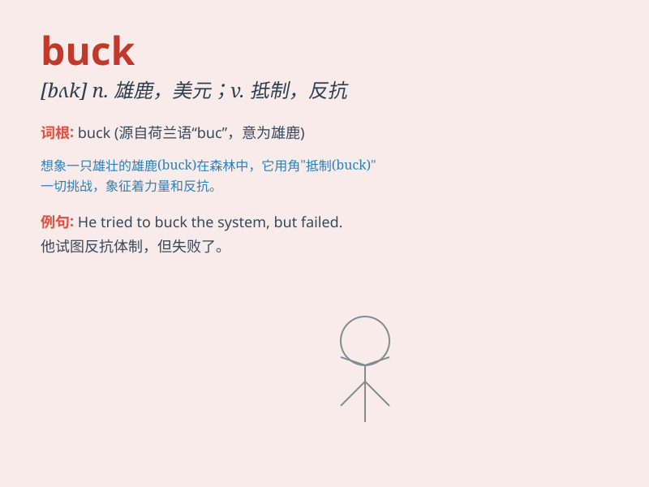

## buck

**英音:** _[bʌk]_ **美音:** _[bʌk]_

**译义:** *n.\<美口>
元,雄鹿,公羊,公兔v.(马等)突然一跃(将骑手摔下)*

### 短语

+ **buck up:** _振作起来；打起精神_

+ **pass the buck:** _推卸责任_

+ **buck the trend:** _反潮流；逆趋势而行_

+ **fast buck:** _轻易得来的钱；快钱_

+ **buck naked:** _一丝不挂；赤条条_

### 例句

#### 例句1

> **The buck stops here.**

**中文翻译:** 责任到此为止。

**单词释义:** 责任

#### 例句2

> **He tried to buck the system.**

**中文翻译:** 他试图反抗这个制度。

**单词释义:** 反抗；抵制

#### 例句3

> **The horse suddenly bucked and threw the rider off.**

**中文翻译:** 马突然猛烈一跳，把骑手甩了下去。

**单词释义:** （马等）猛然弓背跃起

### 背诵小故事

> A brave cowboy was riding a wild horse. The horse was trying to buck
and throw him off. But the cowboy held on tight. Finally, the horse
stopped bucking and became calm. The cowboy won the battle against the
bucking horse.

**一位勇敢的牛仔骑着一匹野马。这匹马试图跳跃并把他甩下来。但牛仔紧紧抓住。最后，马停止跳跃变得安静了。牛仔赢得了与这匹跳跃的马的战斗。**

### 图义

