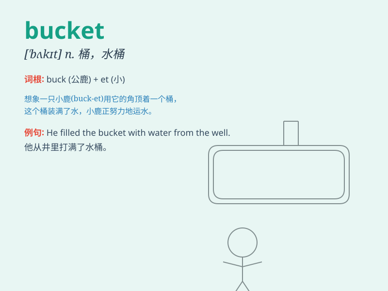

## bucket

**英音:** _[\'bʌkɪt]_ **美音:** _[\'bʌkɪt]_

**译义:** *n.桶,一桶的量,[桶壮物]铲斗*

### 短语

+ **bucket list:** _人生目标清单；愿望清单_

+ **kick the bucket:** _死掉；一命呜呼_

+ **a bucket of water:** _一桶水_

+ **bucket seat:** _凹背折椅；桶形座椅_

+ **ice bucket:** _冰桶_

### 例句

#### 例句1

> **He filled the bucket with water.**

**中文翻译:** 他把水桶装满了水。

**单词释义:** 桶

#### 例句2

> **The rain was coming down in buckets.**

**中文翻译:** 雨倾盆而下。

**单词释义:** 大量

#### 例句3

> **She kicked the bucket last week.**

**中文翻译:** 她上周去世了。

**单词释义:** 死亡

### 背诵小故事

> A little boy was playing in the garden. He used a bucket to carry
water and pour it on the flowers. The bucket was his helpful tool. It
was blue and had a strong handle.

**一个小男孩在花园里玩耍。他用一个桶提水并浇花。这个桶是他的得力工具。它是蓝色的，还有一个坚固的把手。**

### 图义

