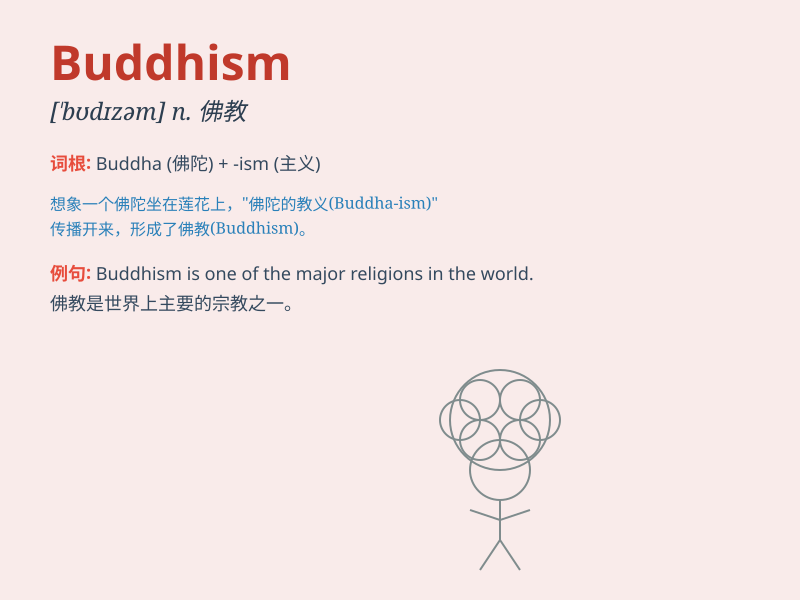

## Buddhism

**英音:** _[ˈbʊdɪzəm]_ **美音:** _[ˈbʊdɪzəm]_

**译义:** *n.佛教，佛教教义*

### 短语

+ **Mahayana Buddhism:** _大乘佛教_

+ **Theravada Buddhism:** _上座部佛教_

+ **Buddhism temple:** _佛教寺庙_

+ **Buddhism belief:** _佛教信仰_

+ **Buddhism culture:** _佛教文化_

### 例句

#### 例句1

> **Buddhism has a profound influence on many people\'s lives.**

**中文翻译:** 佛教对许多人的生活有着深远的影响。

**单词释义:** 佛教

#### 例句2

> **She is deeply interested in Buddhism and often studies its
teachings.**

**中文翻译:** 她对佛教深感兴趣，并且经常研究其教义。

**单词释义:** 佛教

#### 例句3

> **The spread of Buddhism brought about significant changes in the
region.**

**中文翻译:** 佛教的传播给这个地区带来了重大的变化。

**单词释义:** 佛教

### 背诵小故事

> A young traveler was lost in a strange land. A wise monk came and
told him about the peace and wisdom of Buddhism. The traveler was deeply
touched and decided to learn more about this path that brings inner
calm.

**一位年轻的旅行者在陌生的地方迷路了。一位智慧的僧侣过来给他讲述了佛教的平和与智慧。旅行者深受触动，决定更多地了解这条带来内心平静的道路。**

### 图义

