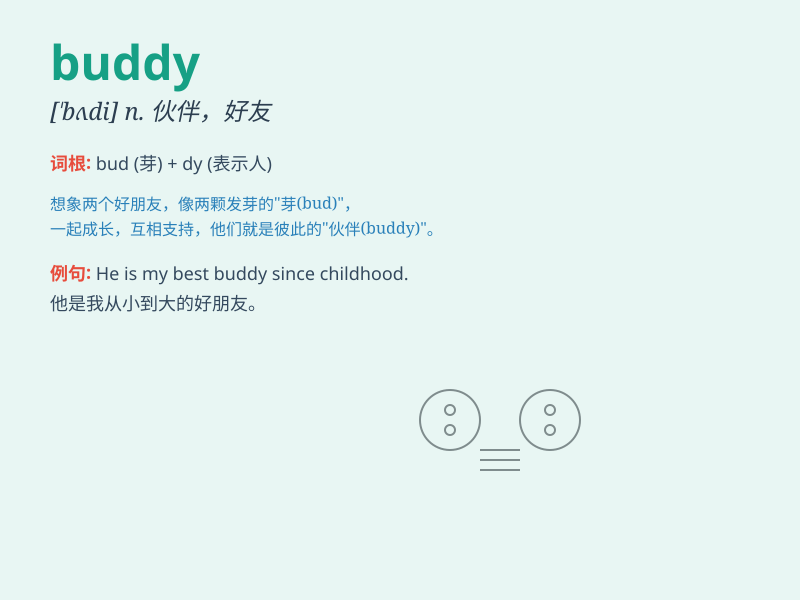

## buddy

**英音:** _[\'bʌdɪ]_ **美音:** _[\'bʌdi]_

**译义:** *n.\<美口>密友,伙伴*

### 短语

+ **buddy system:** _伙伴系统；结伴制_

+ **buddy up:** _成为伙伴；结为朋友_

+ **buddy movie:** _伙伴电影（以两个主角之间的关系为主线的电影）_

+ **travel buddy:** _旅行伙伴_

+ **work buddy:** _工作伙伴_

### 例句

#### 例句1

> **Hey, buddy! How\'s it going?**

**中文翻译:** 嘿，朋友！最近怎么样？

**单词释义:** 朋友；伙伴

#### 例句2

> **He\'s my buddy from childhood.**

**中文翻译:** 他是我儿时的伙伴。

**单词释义:** 伙伴；朋友

#### 例句3

> **Come on, buddy, let\'s go for a walk.**

**中文翻译:** 来吧，伙计，咱们去散步。

**单词释义:** 伙计；朋友

### 背诵小故事

> One day, when I was lost in a strange city, a kind man came to my
aid. I called him \'buddy\' because he felt like a true friend. He
guided me and made me feel safe. From then on, I remember \'buddy\' as a
word for a helpful pal.

**有一天，当我在一个陌生的城市迷路时，一个善良的人来帮助我。我称他为"buddy（伙伴）"，因为他感觉就像一个真正的朋友。他为我指路，让我感到安全。从那时起，我记住"buddy"这个词是表示有帮助的朋友。**

### 图义

