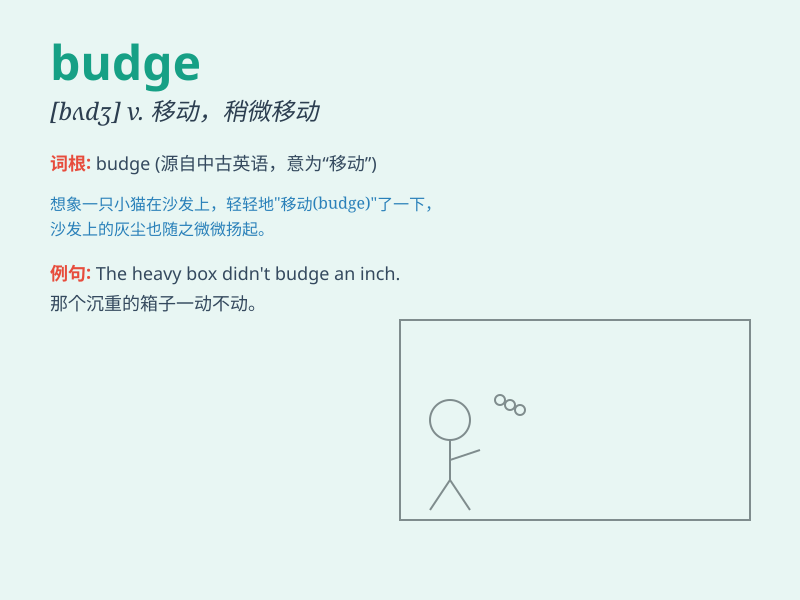

## budge

**英音:** _[bʌdʒ]_ **美音:** _[bʌdʒ]_

**译义:** *v.移动*

### 短语

+ **budge up:** _挪动一下；让开点_

+ **not budge an inch:** _丝毫不动；寸步不让_

+ **budge from:** _从\...移动；偏离\..._

+ **won\'t budge:** _不肯让步；不愿改变_

+ **budge out of the way:** _让开；躲开_

### 例句

#### 例句1

> **The heavy box wouldn\'t budge an inch.**

**中文翻译:** 这个沉重的箱子一寸也挪不动。

**单词释义:** 移动；挪动

#### 例句2

> **He tried to push the door but it wouldn\'t budge.**

**中文翻译:** 他试图推开门，但门纹丝不动。

**单词释义:** （使）改变主意；（使）让步

#### 例句3

> **No matter how hard I persuaded him, he wouldn\'t budge.**

**中文翻译:** 无论我怎么劝他，他都不肯让步。

**单词释义:** 改变立场；动摇

### 背诵小故事

>
想象一只胖乎乎的小熊，它正躺在舒适的草地上睡觉。无论你怎么推它，它都一动不动。直到你拿出它最爱的蜂蜜，它才稍微
budge 了一下。这里 budge 就是移动、改变位置的意思。

**想象一只胖小熊，无论怎么推都不动，拿出蜂蜜才稍微移动了下，解释 budge
为移动、改变位置的意思。**

### 图义

