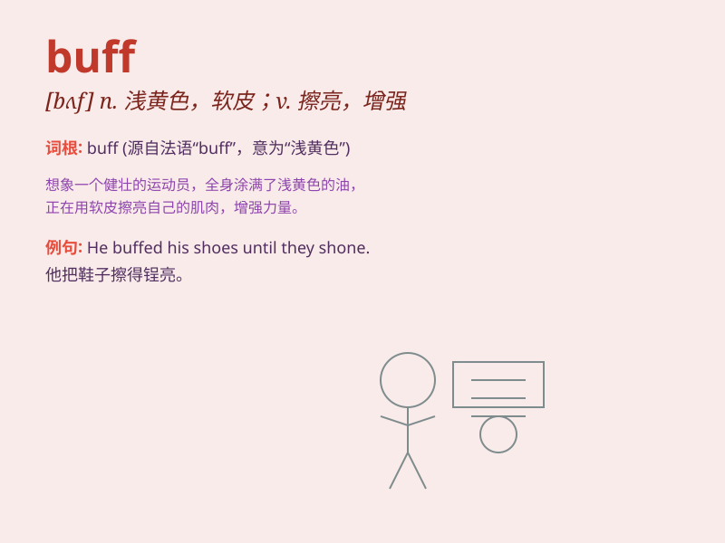

## buff

**英音:** _[bʌf]_ **美音:** _[bʌf]_

**译义:** *n.浅黄色,软皮*

### 短语

+ **buff up:** _擦亮；改善；加强_

+ **in the buff:** _裸体；一丝不挂_

+ **buff color:** _浅黄色；米色_

+ **buff leather:** _软皮；磨砂皮_

+ **buff coat:** _（旧时的）一种紧身皮上衣_

### 例句

#### 例句1

> **He spends hours buffing his car to make it shine.**

**中文翻译:** 他花了几个小时擦拭他的汽车以使它闪闪发亮。

**单词释义:** 擦亮；磨光

#### 例句2

> **The video game buff is always looking for the latest
releases.**

**中文翻译:** 这个电子游戏爱好者总是在寻找最新发布的游戏。

**单词释义:** 爱好者；行家

#### 例句3

> **She had to buff up on her history before the exam.**

**中文翻译:** 她不得不在考试前复习她的历史知识。

**单词释义:** 温习；提高

### 背诵小故事

> A brave warrior was always buff. Before each battle, he trained hard
to keep his body strong. His buff muscles made him fearless. One day, he
defeated all the enemies easily with his buff power.

**一位勇敢的战士总是很强壮。每次战斗前，他都努力训练以保持身体强壮。他强壮的肌肉使他无所畏惧。有一天，他凭借强壮的力量轻松击败了所有敌人。**

### 图义

