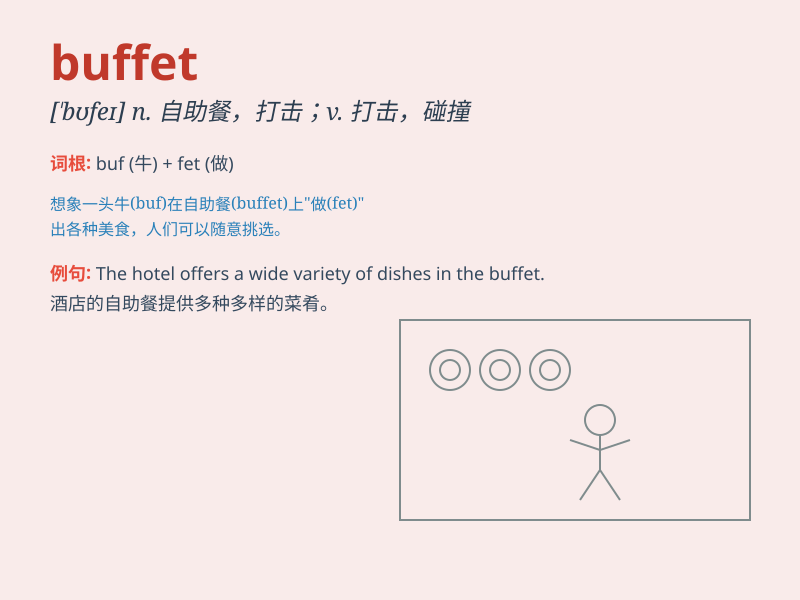

## buffet

**英音:** _[ˈbʊfeɪ;ˈbʌfɪt]_ **美音:** _[bəˈfe; bʌfɪt]_

**译义:** *n.餐具柜,小卖部,殴打,打击v.打击,搏斗*

### 短语

+ **buffet dinner:** _自助晚餐_

+ **buffet lunch:** _自助午餐_

+ **buffet table:** _自助餐桌_

+ **buffet car:** _餐车_

+ **buffet style:** _自助式_

### 例句

#### 例句1

> **The wind buffeted the ship as it sailed through the storm.**

**中文翻译:** 当船在暴风雨中航行时，风猛烈地冲击着它。

**单词释义:** 猛击；冲击

#### 例句2

> **We had a buffet lunch at the hotel.**

**中文翻译:** 我们在酒店吃了自助午餐。

**单词释义:** 自助餐

#### 例句3

> **He was buffeted by a series of personal problems.**

**中文翻译:** 他受到了一系列个人问题的打击。

**单词释义:** 打击；连续猛击

### 背诵小故事

>
想象一下，在一个豪华餐厅里，有一个长长的自助餐桌（buffet），上面摆满了各种美味的食物。人们可以自由地选择自己喜欢的美食，尽情享受这丰富的自助餐。

**想象在豪华餐厅里有摆满美食的自助餐桌，人们自由选择享用，以此记住buffet（自助餐；打击）这个词。**

### 图义

