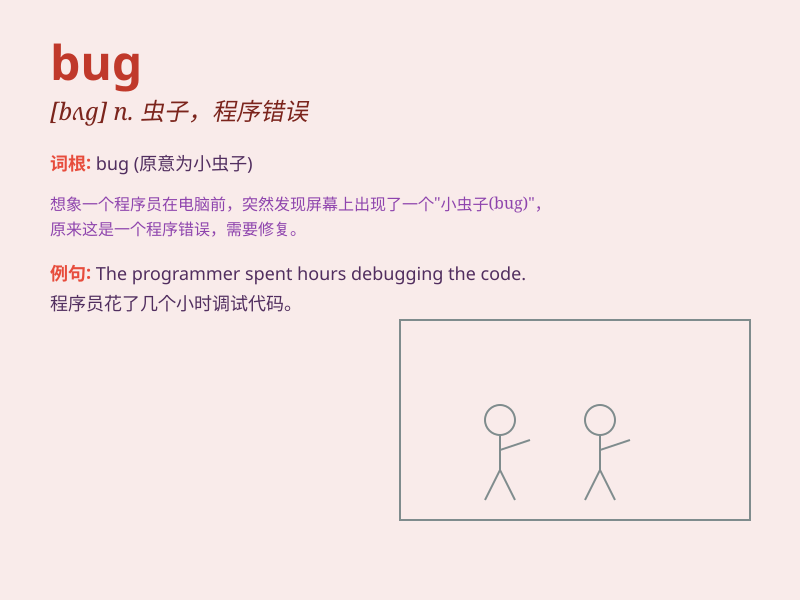

## bug

**英音:** _[bʌg]_ **美音:** _[bʌɡ]_

**译义:** *n.小虫,臭虫,缺陷,错误;v.装置窃昕器,打扰*

### 短语

+ **software bug:** _软件漏洞_

+ **debug:** _调试；排错_

+ **bug out:** _匆忙离开；逃跑_

+ **put a bug in one\'s ear:** _事先给某人暗示；提醒某人_

+ **have a bug about sth.:** _热衷于某事；对某事着迷_

### 例句

#### 例句1

> **There is a bug in the software.**

**中文翻译:** 软件中有一个漏洞。

**单词释义:** 漏洞；缺陷

#### 例句2

> **I think I\'ve caught a bug.**

**中文翻译:** 我觉得我染上病毒了。

**单词释义:** 病毒；病菌

#### 例句3

> **The room was full of bugs.**

**中文翻译:** 房间里到处都是虫子。

**单词释义:** 虫子；昆虫

### 背诵小故事

> One day, a programmer was working hard on a project. Suddenly, the
program stopped working. After checking, he found a bug in the code. It
was like a tiny monster causing trouble and preventing the program from
running smoothly.

**有一天，一个程序员正在努力做一个项目。突然，程序停止运行了。检查之后，他在代码里发现了一个漏洞。它就像一个小怪兽，制造麻烦，阻碍程序顺利运行。**

### 图义

