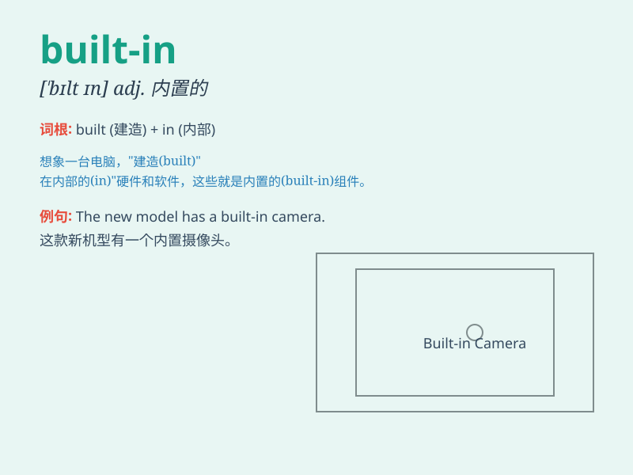

## built-in

**英音:** _[ˈbɪlt-ɪn]_ **美音:** _[ˈbɪlt-ɪn]_

**译义:** *adj. 嵌入式的；内置的；固有的*

### 短语

+ **built-in closet:** _嵌入式壁橱_

+ **built-in bookcase:** _嵌入式书柜_

+ **built-in oven:** _嵌入式烤箱_

+ **built-in furniture:** _嵌入式家具_

+ **built-in feature:** _内置特性_

### 例句

#### 例句1

> **The new computer has a built-in camera.**

**中文翻译:** 这台新电脑有一个内置摄像头。

**单词释义:** 内置的；嵌入的

#### 例句2

> **The car comes with a built-in GPS navigation system.**

**中文翻译:** 这辆车配有内置的 GPS 导航系统。

**单词释义:** 内置的；嵌入的

#### 例句3

> **The oven has a built-in timer for easy cooking.**

**中文翻译:** 这个烤箱有一个内置的定时器，方便烹饪。

**单词释义:** 内置的；嵌入的

### 背诵小故事

>
想象一下，你走进一个未来的房子，发现所有的家具都是built-in的。床和墙壁完美融合，柜子像是房子与生俱来的一部分。这就是内置、固有的意思，就像这些家具和房子不可分割。

**想象走进未来房子，家具都是内置的，床与墙融合，柜子像房子一部分，以此体现built-in表示内置、固有的意思**

### 图义

