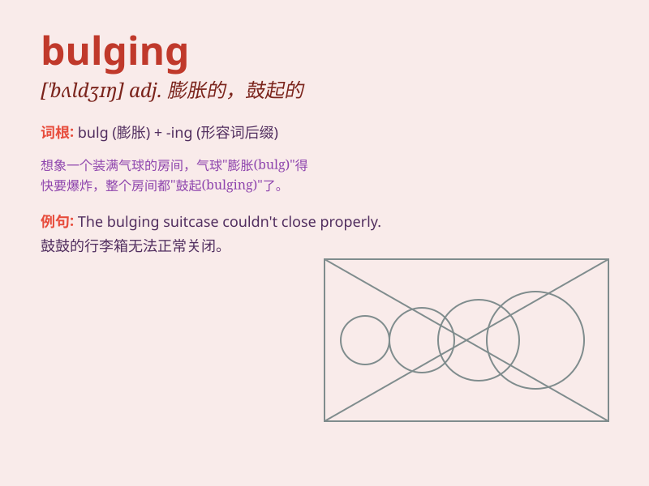

## bulging

**英音:** _[\'bʌldʒɪŋ]_ **美音:** _[\'bʌldʒɪŋ]_

**译义:** *adj.膨胀的，突出的，鼓起的*

### 短语

+ **bulging eyes:** _凸出的眼睛_

+ **bulging muscles:** _鼓起的肌肉_

+ **bulging bag:** _鼓起来的包_

+ **bulging pocket:** _鼓起的口袋_

+ **bulging vein:** _凸起的静脉_

### 例句

#### 例句1

> **His eyes were bulging with anger.**

**中文翻译:** 他气得眼睛鼓鼓的。

**单词释义:** 凸出；鼓胀

#### 例句2

> **The bag was bulging with books.**

**中文翻译:** 袋子里装满了书，鼓鼓囊囊的。

**单词释义:** 充满；塞满

#### 例句3

> **The muscles in his arms were bulging as he lifted the heavy
weight.**

**中文翻译:** 他举起重物时手臂上的肌肉鼓了起来。

**单词释义:** 鼓起；隆起

### 背诵小故事

> A thief was trying to sneak into a house. When he looked through the
window, he saw a bulging bag full of jewels. But suddenly, the alarm
went off! \'Bulging\' here means sticking out or swelling.

**一个小偷试图潜入一所房子。当他透过窗户看时，他看到一个鼓鼓的装满珠宝的袋子。但突然，警报响了！这里的'bulging'意思是突出或膨胀。**

### 图义

