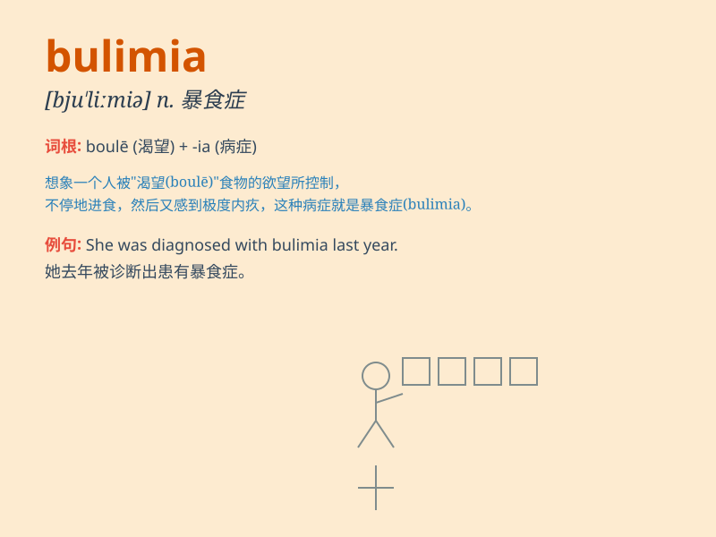

## bulimia

**英音:** _[bjʊ\'lɪmɪə; bʊ-]_ **美音:** _[bu\'lɪmɪə]_

**译义:** *n.易饿病*

### 短语

+ **bulimia nervosa:** _神经性贪食症_

+ **suffer from bulimia:** _患有贪食症_

+ **treat bulimia:** _治疗贪食症_

+ **bulimia symptoms:** _贪食症症状_

+ **recovery from bulimia:** _从贪食症中恢复_

### 例句

#### 例句1

> **She has been struggling with bulimia for years.**

**中文翻译:** 她与贪食症抗争多年了。

**单词释义:** 贪食症

#### 例句2

> **Bulimia can have serious effects on one\'s health.**

**中文翻译:** 贪食症会对人的健康产生严重影响。

**单词释义:** 贪食症

#### 例句3

> **The doctor is treating a patient with bulimia.**

**中文翻译:** 医生正在治疗一位患有贪食症的病人。

**单词释义:** 贪食症

### 背诵小故事

>
想象有个叫莉莉的女孩，她总是无法控制自己的食欲，疯狂吃东西，然后又因为内疚而强迫自己呕吐。这种暴饮暴食又催吐的行为就是
bulimia ，可怜的莉莉被这种病折磨着。

**想象一个女孩因无法控制食欲，暴饮暴食后又催吐，这种行为就是\'贪食症\'，以此记住\'bulimia\'这个单词**

### 图义

