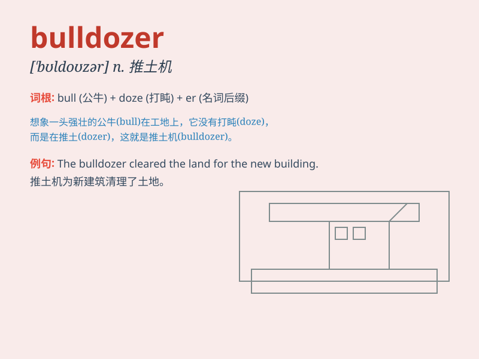

## bulldozer

**英音:** _[\'bʊldəʊzə]_ **美音:** _[\'bʊl\'dozɚ]_

**译义:** *n.推土机*

### 短语

+ **bulldozer blade:** _推土机铲刀_

+ **bulldozer operator:** _推土机操作员_

+ **tracked bulldozer:** _履带式推土机_

+ **bulldozer attachment:** _推土机附件_

+ **bulldozer work:** _推土机作业_

### 例句

#### 例句1

> **The bulldozer was used to clear the land for the new construction
project.**

**中文翻译:** 推土机被用于为新的建筑项目清理土地。

**单词释义:** 推土机

#### 例句2

> **The powerful bulldozer effortlessly pushed aside the large
boulders.**

**中文翻译:** 这台强大的推土机毫不费力地推开了巨大的石块。

**单词释义:** 推土机

#### 例句3

> **The bulldozer operator skillfully maneuvered the machine through
the narrow passage.**

**中文翻译:** 推土机操作员熟练地操纵着机器通过狭窄的通道。

**单词释义:** 推土机

### 背诵小故事

> One day, a big construction site was in chaos. Then a powerful
bulldozer came. It pushed away all the obstacles with its strong blade,
like a brave warrior. People were amazed by its might.

**一天，一个大型建筑工地一片混乱。随后，一辆强大的推土机来了。它用强大的推土铲推开了所有的障碍，就像一个勇敢的战士。人们对它的力量感到惊讶。**

### 图义

