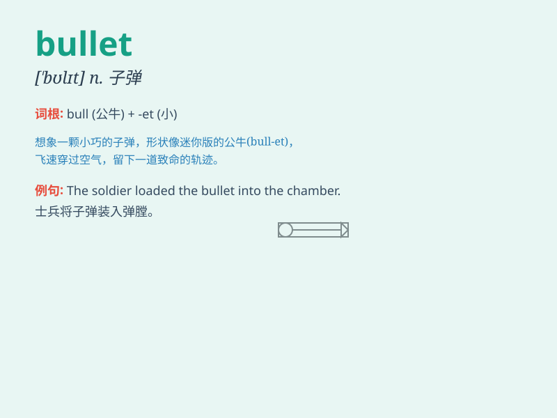

## bullet

**英音:** _[\'bʊlɪt]_ **美音:** _[\'bʊlɪt]_

**译义:** *n.子弹*

### 短语

+ **bullet point:** _重点；要点_

+ **bullet train:** _高速列车；子弹头列车_

+ **silver bullet:** _良方；高招；灵丹妙药_

+ **magic bullet:** _神奇的子弹；灵丹妙药_

+ **bullet wound:** _枪伤；子弹创伤_

### 例句

#### 例句1

> **The bullet pierced through the wall.**

**中文翻译:** 子弹穿透了墙壁。

**单词释义:** 子弹

#### 例句2

> **He dodged the bullet and survived the attack.**

**中文翻译:** 他躲开了子弹，在袭击中幸存下来。

**单词释义:** 子弹

#### 例句3

> **The police found several bullets at the crime scene.**

**中文翻译:** 警察在犯罪现场发现了几颗子弹。

**单词释义:** 子弹

### 背诵小故事

> A brave detective was chasing a criminal. Suddenly, a bullet flew
past his ear. He realized the danger and quickly found cover. The bullet
reminded him of the importance of staying alert in dangerous situations.

**一位勇敢的侦探正在追捕一名罪犯。突然，一颗子弹从他耳边飞过。他意识到危险，迅速寻找掩护。这颗子弹让他想起在危险情况下保持警惕的重要性。**

### 图义

