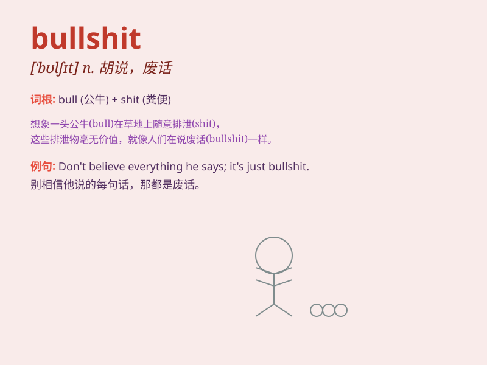

## bullshit

**英音:** _[\'bʊlʃɪt]_ **美音:** _[\'bʊlʃɪt]_

**译义:** *n.胡说*

### 短语

+ **total bullshit:** _完全胡说；一派胡言_

+ **cut the bullshit:** _别废话；别胡说_

+ **bullshit artist:** _胡说八道的人；吹牛大王_

+ **full of bullshit:** _充满胡言乱语_

+ **call bullshit:** _指出胡说；揭穿谎言_

### 例句

#### 例句1

> **Don\'t give me that bullshit. I know the truth.**

**中文翻译:** 别跟我说那些废话。我知道真相。

**单词释义:** 无意义的话；胡说

#### 例句2

> **This report is full of bullshit.**

**中文翻译:** 这份报告充满了胡言乱语。

**单词释义:** 谎言；瞎扯

#### 例句3

> **I\'m not going to listen to your bullshit anymore.**

**中文翻译:** 我再也不想听你的胡话了。

**单词释义:** 假话；空话

### 背诵小故事

>
想象一下，在一个农场里，有一头公牛（bull）总是到处拉便便（shit），搞得农场臭气熏天。人们看到就会说：这简直是胡说八道（bullshit），怎么能这么不讲卫生！

**想象在农场中公牛乱拉便便，人们借此形容胡说八道的情况**

### 图义

