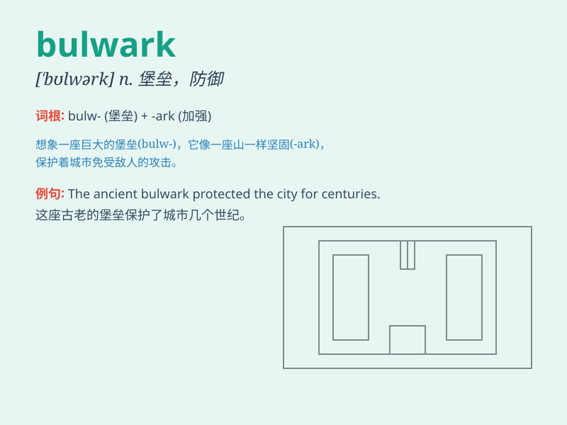

## bulwark

**英音:** _[\'bʊlwək]_ **美音:** _[\'bʊlwɝk]_

**译义:** *n.壁垒,防波堤*

### 短语

+ **bulwark against:** _抵御；防范_

+ **a bulwark of defense:** _防御工事_

+ **bulwark of freedom:** _自由的堡垒_

+ **emotional bulwark:** _情感的屏障_

+ **moral bulwark:** _道德防线_

### 例句

#### 例句1

> **The Great Wall was once a bulwark against invaders.**

**中文翻译:** 长城曾经是抵御侵略者的壁垒。

**单词释义:** 壁垒；防御工事

#### 例句2

> **Honesty and integrity are the bulwarks of a successful
relationship.**

**中文翻译:** 诚实和正直是成功关系的保障。

**单词释义:** 保障；支柱

#### 例句3

> **The new law is seen as a bulwark against corruption.**

**中文翻译:** 新法律被视为反腐败的屏障。

**单词释义:** 屏障；堡垒

### 背诵小故事

> A brave knight stood on the bulwark of the castle, defending it from
invaders. The bulwark was strong and tall, giving him a secure position.
With his sword in hand, he was determined to protect his home.

**一位勇敢的骑士站在城堡的壁垒上，抵御着入侵者。这个壁垒坚固又高大，给他提供了一个安全的位置。他手握长剑，决心保卫家园。**

### 图义

