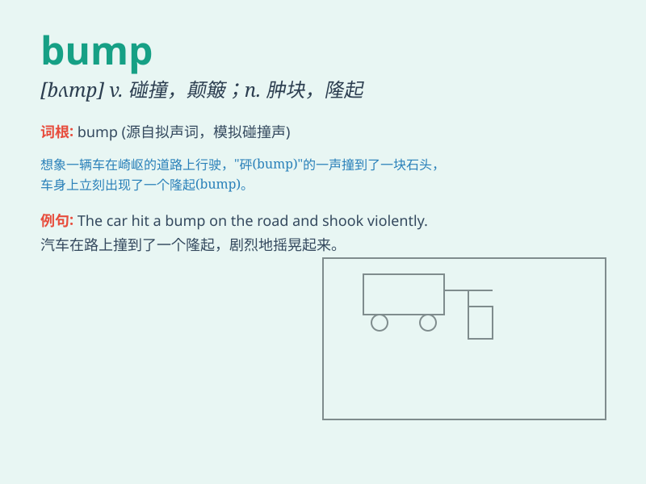

## bump

**英音:** _[bʌmp]_ **美音:** _[bʌmp]_

**译义:** *n.撞击,肿块v.碰(伤),撞(破),颠簸*

### 短语

+ **bump into:** _偶然遇见；碰到_

+ **bump off:** _谋杀；杀死_

+ **bump along:** _颠簸而行_

+ **bump up:** _增加；提高_

+ **bump against:** _撞着；碰到_

### 例句

#### 例句1

> **I bumped my head on the low ceiling.**

**中文翻译:** 我把头撞在了低矮的天花板上。

**单词释义:** 碰撞；撞击

#### 例句2

> **The car bumped along the rough road.**

**中文翻译:** 汽车在崎岖的路上颠簸而行。

**单词释义:** 颠簸；上下晃动

#### 例句3

> **She bumped into an old friend at the supermarket.**

**中文翻译:** 她在超市里偶然碰到了一位老朋友。

**单词释义:** 偶然遇见；碰到

### 背诵小故事

> One night, I was walking in the dark and suddenly bumped into a big
tree. It hurt a lot! \'Bump\' means hitting something unexpectedly.
Remember my painful experience to remember this word.

**一天晚上，我在黑暗中行走，突然撞到了一棵大树。疼极了！'bump'意思是意外地撞到某物。记住我的痛苦经历来记住这个单词。**

### 图义

