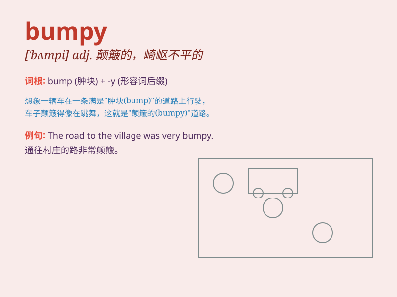

## bumpy

**英音:** _[\'bʌmpɪ]_ **美音:** _[\'bʌmpi]_

**译义:** *adj.(道路等)颠簸的,崎岖不平的*

### 短语

+ **bumpy road:** _崎岖的道路_

+ **bumpy flight:** _颠簸的飞行_

+ **bumpy ride:** _颠簸的行程_

+ **bumpy surface:** _凹凸不平的表面_

+ **bumpy journey:** _艰难的旅程_

### 例句

#### 例句1

> **The road was bumpy and full of potholes.**

**中文翻译:** 这条路崎岖不平，到处都是坑洼。

**单词释义:** 崎岖不平的

#### 例句2

> **The flight was a bit bumpy due to the turbulence.**

**中文翻译:** 由于气流，这次飞行有点颠簸。

**单词释义:** 颠簸的

#### 例句3

> **The relationship between them has been bumpy recently.**

**中文翻译:** 他们之间的关系最近一直很坎坷。

**单词释义:** 坎坷的

### 背诵小故事

> One day, I was on a bumpy road. The car kept bouncing up and down. It
was a very uncomfortable ride. I\'ll never forget this \'bumpy\'
experience.

**有一天，我走在一条崎岖不平的路上。车子不停地上下颠簸。这是一次非常不舒服的行程。我永远不会忘记这次"颠簸的"经历。**

### 图义

