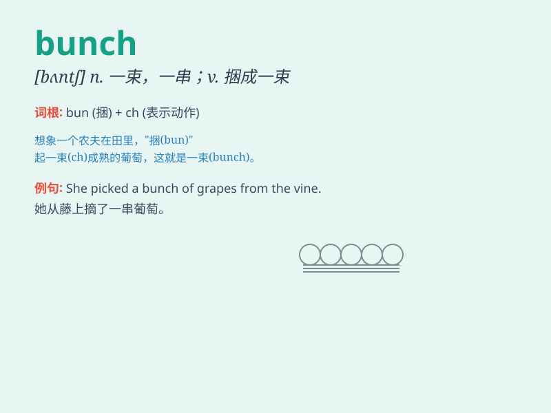

## bunch

**英音:** _[bʌn(t)ʃ]_ **美音:** _[bʌntʃ]_

**译义:** *n.串,束v.捆成一束*

### 短语

+ **a bunch of:** _一束；一串；一群；大量_

+ **bunch up:** _聚成一团；挤在一起_

+ **bunch together:** _聚集在一起_

+ **flower bunch:** _花束_

+ **bunch of grapes:** _一串葡萄_

### 例句

#### 例句1

> **She received a bunch of flowers on her birthday.**

**中文翻译:** 她在生日那天收到了一束花。

**单词释义:** 束；串；群

#### 例句2

> **A bunch of keys were on the table.**

**中文翻译:** 桌子上有一串钥匙。

**单词释义:** 串；束

#### 例句3

> **He is a bunch of nerves before the exam.**

**中文翻译:** 他在考试前非常紧张。

**单词释义:** 大量；大批

### 背诵小故事

> A bunch of monkeys were playing in the forest. They jumped around
happily, forming a lively group. The word \'bunch\' here means a group
or collection. Just like these monkeys, a bunch can represent a number
of things together.

**一群猴子在森林里玩耍。它们欢快地跳来跳去，形成了一个热闹的群体。这里"bunch"这个单词意思是一群或一堆。就像这些猴子一样，"bunch"可以表示许多东西在一起。**

### 图义

