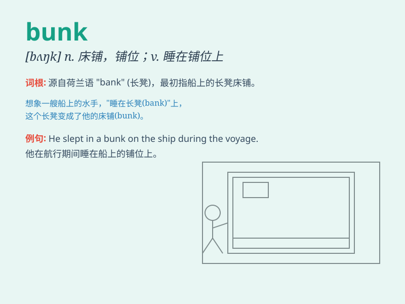

## bunk

**英音:** _[bʌŋk]_ **美音:** _[bʌŋk]_

**译义:** *n.(轮船,火车等)铺位*

### 短语

+ **bunk bed:** _双层床_

+ **bunk off:** _逃学；旷工_

+ **do the bunk:** _逃走；逃跑_

+ **bunk down:** _随便睡下；临时住宿_

+ **bunk up:** _（使）睡在同一张床上_

### 例句

#### 例句1

> **He took a bunk on the train and slept all the way.**

**中文翻译:** 他在火车上占了一个铺位，一路睡了过去。

**单词释义:** 铺位

#### 例句2

> **Don\'t believe that bunk. It\'s just a rumor.**

**中文翻译:** 别相信那套胡言乱语。那只是个谣言。

**单词释义:** 胡言乱语；废话

#### 例句3

> **The workers decided to bunk off and go to the beach.**

**中文翻译:** 工人们决定旷工去海滩。

**单词释义:** 旷工；逃学

### 背诵小故事

> A boy was on a camping trip. At night, he climbed into his bunk bed.
But the bunk was so small and uncomfortable. He couldn\'t sleep well.
\'Bunk\' means a bed or sleeping place like this.

**一个男孩在露营旅行。晚上，他爬上了他的双层床。但这张双层床又小又不舒服。他睡不好。\'bunk\'指的就是这样的床或睡觉的地方。**

### 图义

