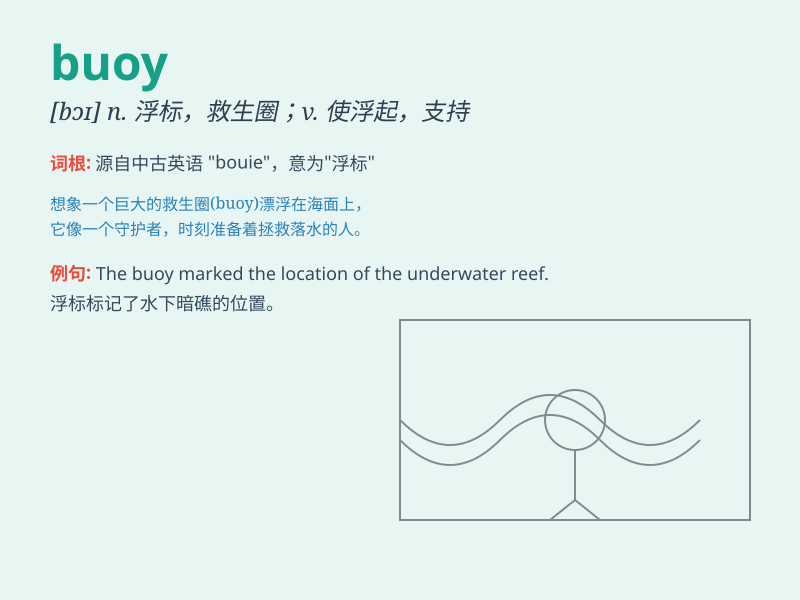

## buoy

**英音:** _[bɒɪ]_ **美音:** _[\'bʊi]_

**译义:** *n.(湖,河等中的)浮标,浮筒,救生圈vt.使浮起,支撑,鼓励*

### 短语

+ **buoy up:** _使振作；使鼓舞_

+ **mooring buoy:** _系泊浮筒_

+ **life buoy:** _救生圈_

+ **channel buoy:** _航道浮标_

+ **buoy marker:** _浮标标志_

### 例句

#### 例句1

> **The buoy marked the safe passage for ships.**

**中文翻译:** 这个浮标为船只标出了安全通道。

**单词释义:** 浮标

#### 例句2

> **Her spirits were buoyed by the good news.**

**中文翻译:** 好消息使她精神振奋。

**单词释义:** 鼓舞；使振作

#### 例句3

> **The economy was buoyed by increased consumer spending.**

**中文翻译:** 经济因消费者支出增加而受到支撑。

**单词释义:** 支撑；支持

### 背诵小故事

> A sailor was lost at sea. But he saw a buoy floating, which gave him
hope. The buoy stayed firm, guiding him safely. Remember, \'buoy\' is
like a savior in the vast ocean.

**一名水手在海上迷路了。但他看到一个浮标在漂浮，这给了他希望。浮标稳稳地停在那里，引导他安全返航。记住，\'buoy\'就像茫茫大海中的救星。**

### 图义

