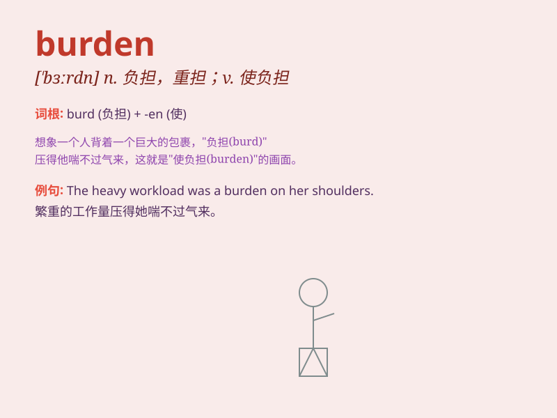

## burden

**英音:** _[\'bɜːd(ə)n]_ **美音:** _[\'bɝdn]_

**译义:** *n.担子,负担v.负担*

### 短语

+ **bear a burden:** _承受负担_

+ **heavy burden:** _沉重的负担_

+ **financial burden:** _经济负担_

+ **burden of proof:** _举证责任_

+ **lift the burden:** _解除负担_

### 例句

#### 例句1

> **The burden of proof lies with the prosecution in a criminal
trial.**

**中文翻译:** 在刑事审判中，举证责任在于控方。

**单词释义:** 责任；负担

#### 例句2

> **She was burdened with heavy debts.**

**中文翻译:** 她负债累累。

**单词释义:** 使负担；使负重

#### 例句3

> **His illness placed a burden on his family.**

**中文翻译:** 他的病给家庭带来了负担。

**单词释义:** 负担；重担

### 背诵小故事

> A little donkey was always sad because it had to carry a heavy burden
every day. One day, it realized that this burden was a responsibility
that made it stronger. So, the donkey accepted the burden. \'Burden\'
means a heavy load or responsibility.

**一只小毛驴总是很伤心，因为它每天都得驮着重担。有一天，它意识到这个重担是一种责任，让它变得更强壮。于是，毛驴接受了这个重担。'burden'意思是重担或责任。**

### 图义

