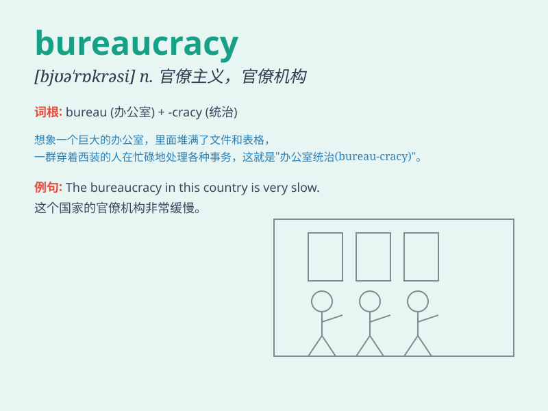

## bureaucracy

**英音:** _[,bjʊ(ə)\'rɒkrəsɪ]_ **美音:**
_[bjʊ\'rɑkrəsi]_

**译义:** *n.官僚,官僚作风,官僚机构*

### 短语

+ **bureaucratic red tape:** _官僚主义的繁文缛节_

+ **bureaucracy system:** _官僚体制_

+ **combat bureaucracy:** _打击官僚主义_

+ **bureaucracy corruption:** _官僚腐败_

+ **bureaucracy inefficiency:** _官僚主义的低效率_

### 例句

#### 例句1

> **The company was bogged down by bureaucracy and red tape.**

**中文翻译:** 这家公司被官僚主义和繁文缛节所拖累。

**单词释义:** 官僚主义；官僚作风

#### 例句2

> **He criticized the excessive bureaucracy in the government.**

**中文翻译:** 他批评了政府中过度的官僚作风。

**单词释义:** 官僚体制；官僚机构

#### 例句3

> **The bureaucracy often hinders efficient decision-making.**

**中文翻译:** 官僚机构常常阻碍有效的决策。

**单词释义:** 官僚机构

### 背诵小故事

> A young man wanted to start a business but was constantly hindered by
bureaucracy. He had to fill countless forms and wait for endless
approvals. Finally, he realized that bureaucracy was all about complex
and inefficient systems.

**一个年轻人想要创业，但不断受到官僚作风的阻碍。他不得不填写无数的表格，等待无尽的审批。最后，他明白了官僚作风就是复杂和低效的系统。**

### 图义

