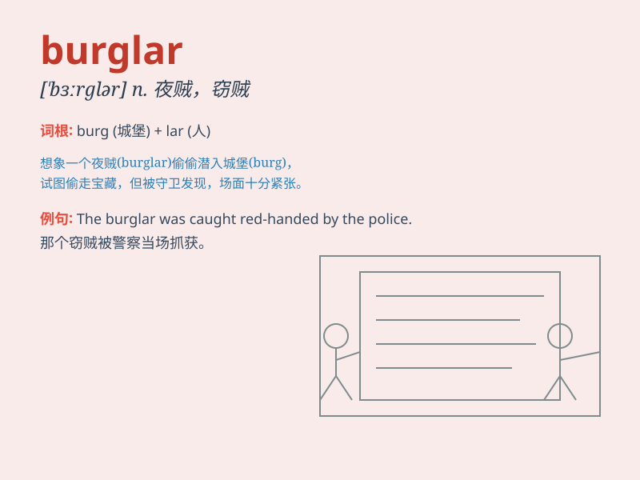

## burglar

**英音:** _[\'bɜːglə]_ **美音:** _[\'bɝɡlɚ]_

**译义:** *n.夜贼*

### 短语

+ **burglar alarm:** _防盗警报器_

+ **burglar proof:** _防盗的_

+ **cat burglar:** _飞贼；身手敏捷的贼_

+ **burglar break-in:** _盗贼闯入_

+ **professional burglar:** _职业窃贼_

### 例句

#### 例句1

> **The burglar broke into the house through the window.**

**中文翻译:** 这个窃贼通过窗户闯进了房子。

**单词释义:** 窃贼

#### 例句2

> **The police caught the burglar red-handed.**

**中文翻译:** 警察当场抓住了这个窃贼。

**单词释义:** 窃贼

#### 例句3

> **We need to install a security system to prevent burglars from
entering.**

**中文翻译:** 我们需要安装一个安保系统来防止窃贼进入。

**单词释义:** 窃贼

### 背诵小故事

> One night, a man named Bob heard strange noises. He saw a figure
sneaking through the window. It was a burglar! Bob called the police
quickly. The burglar was caught and sent to prison.

**一天晚上，一个叫鲍勃的人听到奇怪的声音。他看到一个身影从窗户偷偷进来。那是个窃贼！鲍勃迅速报警。窃贼被抓住并送进了监狱。**

### 图义

