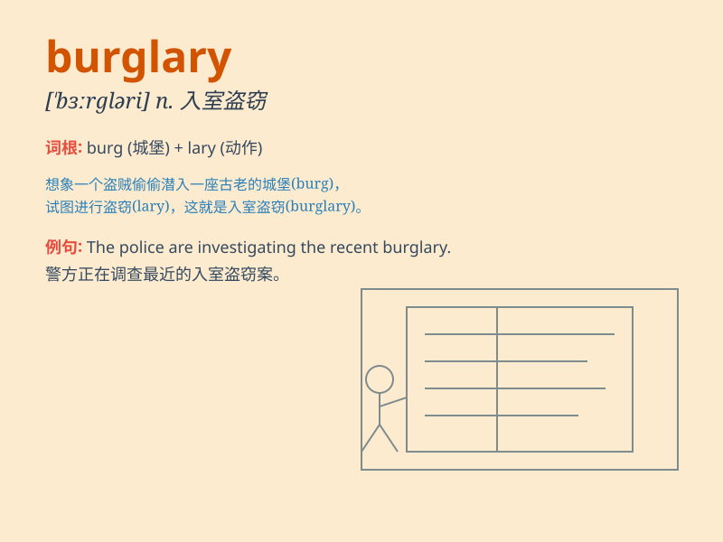

## burglary

**英音:** _[\'bɜːglərɪ]_ **美音:** _[\'bɝɡləri]_

**译义:** *v.入室行窃*

### 短语

+ **commit burglary:** _进行盗窃_

+ **burglary attempt:** _盗窃企图_

+ **burglary case:** _盗窃案件_

+ **burglary insurance:** _盗窃保险_

+ **burglary suspect:** _盗窃嫌疑犯_

### 例句

#### 例句1

> **The police are investigating a burglary at the local jewelry
store.**

**中文翻译:** 警方正在调查当地珠宝店的一起盗窃案。

**单词释义:** 盗窃行为；入室盗窃

#### 例句2

> **He was convicted of burglary and sentenced to three years in
prison.**

**中文翻译:** 他被判犯有入室盗窃罪，并被判处三年监禁。

**单词释义:** 入室盗窃（罪）

#### 例句3

> **Burglary is a serious crime that can have a huge impact on the
victims.**

**中文翻译:** 盗窃是一种严重的犯罪，可能对受害者产生巨大影响。

**单词释义:** 盗窃（罪行）

### 背诵小故事

> One night, a thief quietly broke into a house. This illegal act of
entering and stealing was called a burglary. The owner was shocked when
they discovered the mess in the morning.

**一天晚上，一个小偷悄悄地闯入一所房子。这种非法进入并偷窃的行为被称为入室盗窃。早上主人发现一片狼藉时感到十分震惊。**

### 图义

