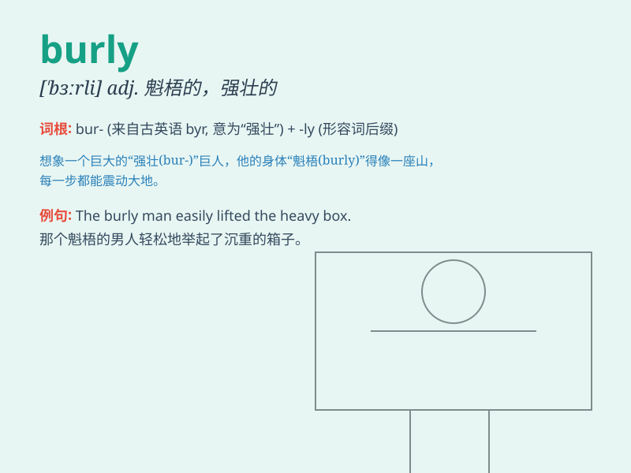

## burly

**英音:** _[\'bɜːlɪ]_ **美音:** _[\'bɝli]_

**译义:** *adj.魁伟的,结实的*

### 短语

+ **burly man:** _强壮的男人_

+ **burly figure:** _魁梧的身材_

+ **burly arms:** _粗壮的胳膊_

+ **burly build:** _健壮的体格_

+ **burly frame:** _结实的身架_

### 例句

#### 例句1

> **The burly construction worker lifted the heavy beam with
ease.**

**中文翻译:** 这位身材魁梧的建筑工人轻松地抬起了沉重的横梁。

**单词释义:** 身材魁梧的

#### 例句2

> **The burly bouncer stood at the entrance of the club.**

**中文翻译:** 那个壮实的保镖站在俱乐部的入口处。

**单词释义:** 壮实的

#### 例句3

> **He was a burly man with a thick beard.**

**中文翻译:** 他是一个体格健壮、留着浓密胡须的男人。

**单词释义:** 体格健壮的

### 背诵小故事

> Once upon a time, there was a strong and burly lumberjack. He could
easily chop down big trees with his powerful arms. His burly figure made
him stand out in the forest. People always relied on him for heavy work.

**从前，有一个强壮魁梧的伐木工人。他能用有力的双臂轻松地砍倒大树。他魁梧的身材使他在森林中很突出。人们总是依靠他做重活。**

### 图义

