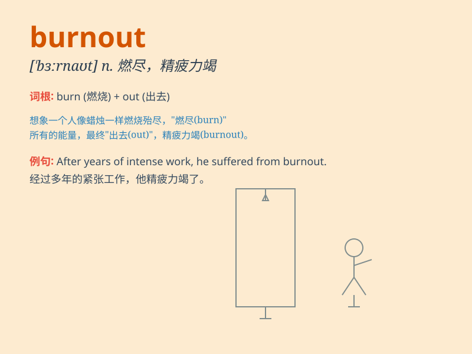

## burnout

**英音:** _[\'bɜːnaʊt]_ **美音:** _[\'bɝnaʊt]_

**译义:** *n.燃尽,烧光,歇火*

### 短语

+ **job burnout:** _工作倦怠_

+ **emotional burnout:** _情绪耗竭_

+ **professional burnout:** _职业倦怠_

+ **burnout syndrome:** _倦怠综合征_

+ **prevent burnout:** _防止倦怠_

### 例句

#### 例句1

> **She experienced burnout after working long hours without a
break.**

**中文翻译:** 她在长时间不间断工作后感到精疲力竭。

**单词释义:** 精疲力竭；过度劳累

#### 例句2

> **The athlete\'s burnout was due to excessive training.**

**中文翻译:** 这位运动员的过度疲劳是由于过度训练造成的。

**单词释义:** 过度疲劳；倦怠

#### 例句3

> **His burnout led him to quit his high-pressure job.**

**中文翻译:** 他的身心俱疲使他辞去了高压工作。

**单词释义:** 身心俱疲；崩溃

### 背诵小故事

> A hardworking athlete trained intensely every day. But soon, he felt
exhausted and lost all motivation. This is burnout. It means being
completely worn out from too much stress.

**一位勤奋的运动员每天都高强度训练。但很快，他感到筋疲力尽，失去了所有动力。这就是
burnout（精疲力竭）。它意味着因压力过大而完全疲惫不堪。**

### 图义

