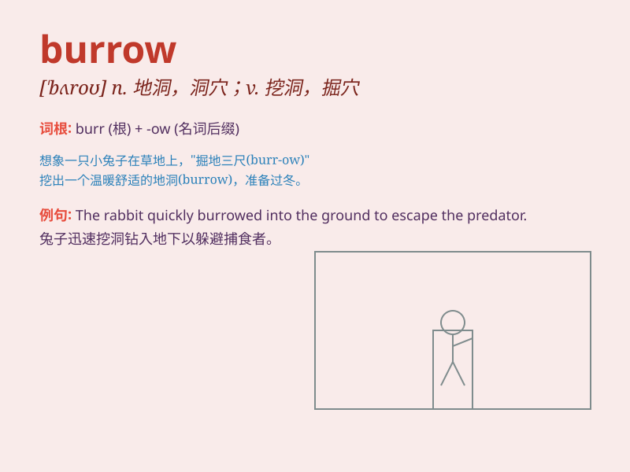

## burrow

**英音:** _[\'bʌrəʊ]_ **美音:** _[\'bɝro]_

**译义:** *n.洞穴v.挖地洞*

### 短语

+ **burrow into:** _钻进；潜入_

+ **burrow through:** _挖通；穿过_

+ **rabbit burrow:** _兔子洞_

+ **burrow den:** _洞穴；兽穴_

+ **burrow under:** _在......下面挖洞_

### 例句

#### 例句1

> **The rabbit burrowed into the ground to hide.**

**中文翻译:** 兔子钻进地里藏起来。

**单词释义:** 挖掘（洞穴）

#### 例句2

> **The mole has a complex burrow system.**

**中文翻译:** 鼹鼠有一个复杂的洞穴系统。

**单词释义:** 洞穴

#### 例句3

> **He likes to burrow himself in the sofa and read a book.**

**中文翻译:** 他喜欢把自己埋在沙发里看书。

**单词释义:** 躲藏；钻进

### 背诵小故事

> A little rabbit was in danger. It quickly found a place to hide and
started to burrow into the ground. With its paws and nose, it made a
nice and safe hole. Now it was safe in its burrow.

**一只小兔子遇到了危险。它迅速找了个地方藏身，并开始往地下挖洞。用它的爪子和鼻子，它挖了一个漂亮又安全的洞。现在它在自己的洞穴里很安全。**

### 图义

