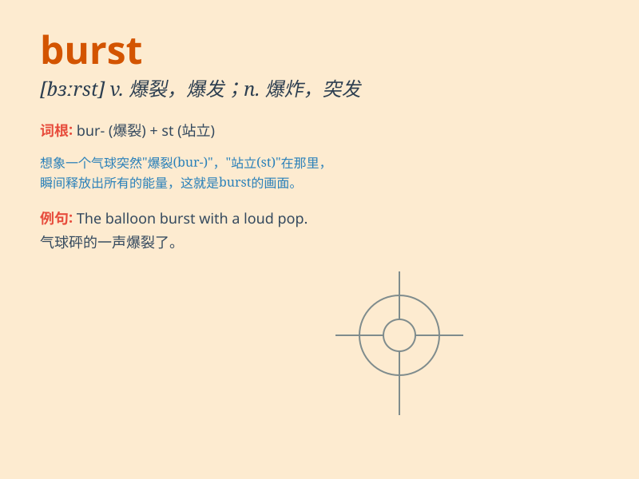

## burst

**英音:** _[bɜːst]_ **美音:** _[bɝst]_

**译义:** *v.爆裂,炸破,急于,爆发n.突然破裂,爆发,脉冲*

### 短语

+ **burst into:** _突然进入（某种状态）_

+ **burst out:** _突然爆发；突然喊出_

+ **burst in:** _闯入；突然出现_

+ **burst forth:** _突然出现；突然发生_

+ **burst open:** _猛然打开_

### 例句

#### 例句1

> **The balloon burst suddenly.**

**中文翻译:** 气球突然爆了。

**单词释义:** （使）爆裂；（使）爆炸

#### 例句2

> **She burst into tears when she heard the bad news.**

**中文翻译:** 当她听到这个坏消息时，突然大哭起来。

**单词释义:** 突然爆发

#### 例句3

> **The door burst open and the children rushed in.**

**中文翻译:** 门突然开了，孩子们冲了进来。

**单词释义:** 猛然打开

### 背诵小故事

> A balloon was floating in the air. Suddenly, a naughty child came and
pricked it with a needle. With a loud noise, the balloon burst. It was a
surprising and quick moment.

**一个气球在空中飘浮着。突然，一个淘气的孩子过来用针把它扎破了。随着一声巨响，气球爆开了。这是一个令人惊讶且迅速的瞬间。**

### 图义

