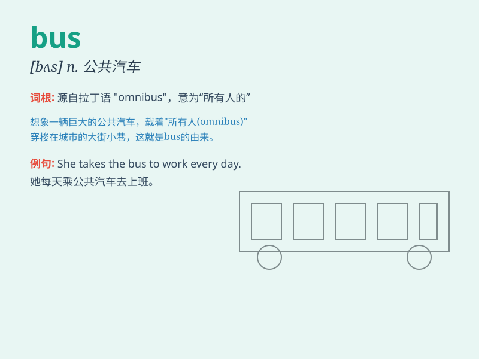

## bus

**英音:** _[bʌs]_ **美音:** _[bʌs]_

**译义:** *n.公共汽车,总线*

### 短语

+ **by bus:** _乘公共汽车_

+ **bus stop:** _公共汽车站_

+ **school bus:** _校车_

+ **bus station:** _公交车站_

+ **catch the bus:** _赶上公共汽车_

### 例句

#### 例句1

> **I take the bus to work every day.**

**中文翻译:** 我每天乘公共汽车去上班。

**单词释义:** 公共汽车

#### 例句2

> **The bus was crowded with passengers.**

**中文翻译:** 公共汽车上挤满了乘客。

**单词释义:** 公共汽车

#### 例句3

> **A new bus line has been opened in our city.**

**中文翻译:** 我们城市开通了一条新的公交线路。

**单词释义:** 公共汽车；公交线路

### 背诵小故事

> One day, Tom was late for school. He ran to the bus stop but the bus
had just left. He was very sad. Then he decided to take a taxi. Finally,
he arrived at school on time. The word \'bus\' means a vehicle for
carrying passengers.

**一天，汤姆上学迟到了。他跑到公交车站，但公交车刚刚开走。他非常伤心。然后他决定乘出租车。最后，他按时到了学校。单词\'bus\'意思是载客的交通工具。**

### 图义

