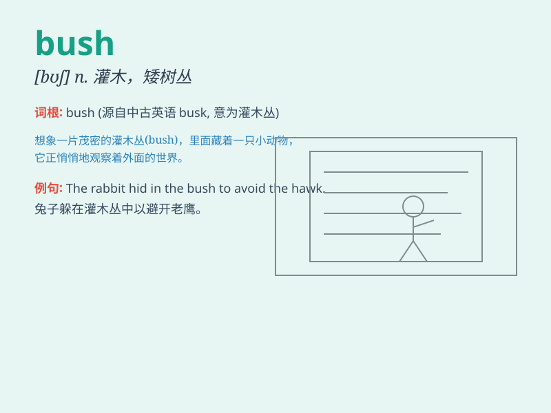

## bush

**英音:** _[bʊʃ]_ **美音:** _[bʊʃ]_

**译义:** *n.矮树丛,(机械)衬套*

### 短语

+ **beat about the bush:** _说话拐弯抹角，旁敲侧击_

+ **bush telegraph:** _小道消息_

+ **go bush:** _去野外；过原始生活_

+ **bush jacket:** _猎装；丛林夹克_

+ **bush baby:** _婴猴（一种小型灵长目动物）_

### 例句

#### 例句1

> **The rabbit hid in the bush.**

**中文翻译:** 兔子藏在灌木丛里。

**单词释义:** 灌木丛

#### 例句2

> **He trimmed the bush in his garden.**

**中文翻译:** 他修剪了花园里的灌木丛。

**单词释义:** 灌木丛

#### 例句3

> **The president emerged from behind the bush.**

**中文翻译:** 总统从灌木丛后面出现了。

**单词释义:** 灌木丛

### 背诵小故事

> A little rabbit was lost in the bush. It was scared and didn\'t know
how to find its way home. But finally, with its strong sense of
direction, it got out of the bush safely.

**一只小兔子在灌木丛中迷路了。它很害怕，不知道怎么找到回家的路。但最后，凭借它强烈的方向感，它安全地走出了灌木丛。**

### 图义

