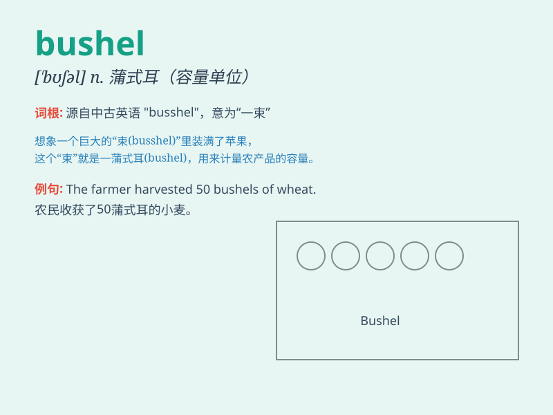

## bushel

**英音:** _[\'bʊʃ(ə)l]_ **美音:** _[\'bʊʃəl]_

**译义:** *n.蒲式耳(容量等于八加仑)v.修补*

### 短语

+ **bushel basket:** _蒲式耳篮_

+ **bushel measure:** _蒲式耳量具_

+ **a bushel of apples:** _一蒲式耳苹果_

+ **bushel of corn:** _一蒲式耳玉米_

+ **bushel of wheat:** _一蒲式耳小麦_

### 例句

#### 例句1

> **He bought two bushels of apples at the market.**

**中文翻译:** 他在市场买了两蒲式耳的苹果。

**单词释义:** 蒲式耳（容量单位）

#### 例句2

> **The farmer harvested ten bushels of wheat this year.**

**中文翻译:** 这位农民今年收获了十蒲式耳的小麦。

**单词释义:** 蒲式耳（容量单位）

#### 例句3

> **A bushel of corn is enough to feed the chickens for a week.**

**中文翻译:** 一蒲式耳的玉米足够喂鸡一周。

**单词释义:** 蒲式耳（容量单位）

### 背诵小故事

> One day, a farmer was very busy. He had to measure a lot of grains
with a bushel. But he lost his bushel and was very worried. Finally, he
found it and happily continued his work.

**一天，一个农民非常忙。他得用蒲式耳来测量很多谷物。但他把蒲式耳弄丢了，非常着急。最后，他找到了，开心地继续工作。**

### 图义

