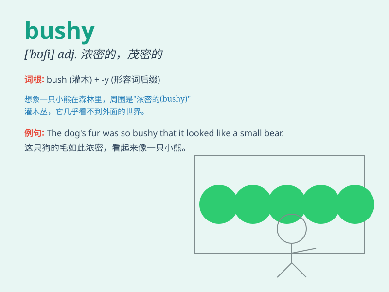

## bushy

**英音:** _[\'bʊʃɪ]_ **美音:** _[bʊʃi]_

**译义:** *adj.灌木茂密的,浓密的*

### 短语

+ **bushy eyebrows:** _浓密的眉毛_

+ **bushy beard:** _浓密的胡须_

+ **bushy hair:** _浓密的头发_

+ **bushy tail:** _浓密的尾巴_

+ **bushy shrub:** _茂密的灌木_

### 例句

#### 例句1

> **The cat has a bushy tail.**

**中文翻译:** 这只猫有一条浓密的尾巴。

**单词释义:** 浓密的（形容尾巴）

#### 例句2

> **She has bushy eyebrows.**

**中文翻译:** 她有浓密的眉毛。

**单词释义:** 浓密的（形容眉毛）

#### 例句3

> **The plant has bushy leaves.**

**中文翻译:** 这株植物有茂密的叶子。

**单词释义:** 茂密的（形容叶子）

### 背诵小故事

> A little rabbit was lost in a forest full of bushy trees. The
branches and leaves were so thick that it was hard to find the way out.
\'Bushy\' describes these thick and dense trees.

**一只小兔子在长满茂密树木的森林里迷路了。树枝和树叶如此浓密，以至于很难找到出路。\'bushy\'形容的就是这些又厚又密的树木。**

### 图义

