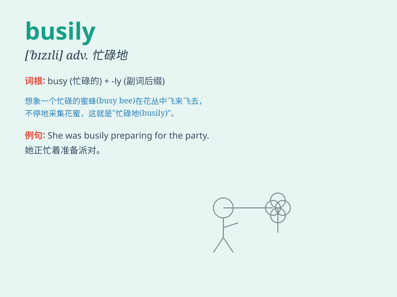

## busily

**英音:** _[\'bɪzɪlɪ]_ **美音:** _[\'bɪzli]_

**译义:** *adv.忙碌地*

### 短语

+ **work busily:** _忙碌地工作_

+ **move busily:** _匆忙地移动_

+ **prepare busily:** _忙碌地准备_

+ **write busily:** _不停地写_

+ **talk busily:** _滔滔不绝地说_

### 例句

#### 例句1

> **She was busily cooking dinner when I arrived home.**

**中文翻译:** 当我到家时，她正忙着做晚餐。

**单词释义:** 忙碌地

#### 例句2

> **The workers were busily assembling the machines in the
factory.**

**中文翻译:** 工人们在工厂里忙着组装机器。

**单词释义:** 忙碌地

#### 例句3

> **He was busily writing his report and didn\'t notice me come
in.**

**中文翻译:** 他正忙着写报告，没有注意到我进来。

**单词释义:** 忙碌地

### 背诵小故事

> One day, Tom was busily working on his homework. His mom called him
for dinner several times, but he was so focused that he didn\'t hear.
Finally, when he finished, he felt relieved.

**一天，汤姆正忙碌地做着他的家庭作业。他妈妈叫了他好几次去吃晚饭，但他太专注了以至于没听见。最后，当他完成时，他感到如释重负。**

### 图义

