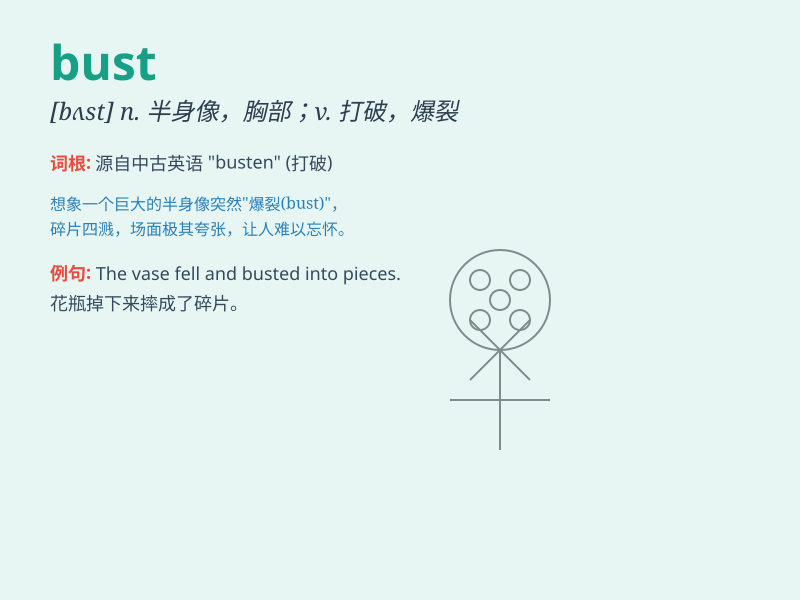

## bust

**英音:** _[bʌst]_ **美音:** _[bʌst]_

**译义:** *n.半身像,胸像,(妇女的)胸部*

### 短语

+ **bust up:** _使破裂；分手；争吵_

+ **bust out:** _突然爆发；逃出_

+ **bust a gut:** _努力做某事；拼命干_

+ **bust someone\'s bubble:** _打破某人的幻想_

+ **go bust:** _破产；倒闭_

### 例句

#### 例句1

> **The police made a bust on the drug trafficking ring.**

**中文翻译:** 警方对贩毒集团进行了一次突击搜查。

**单词释义:** 突击搜查

#### 例句2

> **Her business went bust after the economic crisis.**

**中文翻译:** 经济危机后她的生意破产了。

**单词释义:** 破产

#### 例句3

> **The sculpture is a beautiful bust of a famous actress.**

**中文翻译:** 这座雕塑是一位著名女演员的漂亮半身像。

**单词释义:** 半身像

### 背诵小故事

> A thief tried to steal a precious statue, but was caught and his plan
went bust. The police arrived just in time and the thief\'s dream of
getting rich quickly was completely shattered.

**一个小偷试图偷一尊珍贵的雕像，但被抓住了，他的计划破产了。警察及时赶到，小偷快速致富的梦想完全破灭了。**

### 图义

