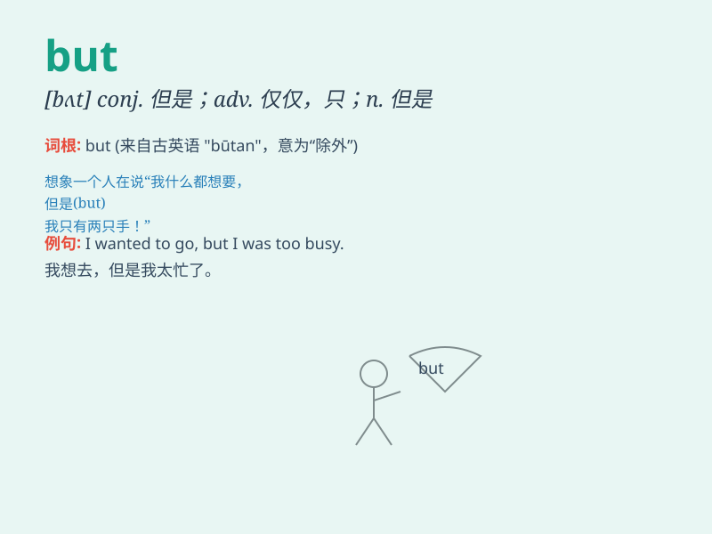

## but

**英音:** _[bʌt; bət]_ **美音:** _[bʌt]_

**译义:** * prep.除\...以外 conj.而是,但是adv.几乎,仅仅*

### 短语

+ **but for:** _要不是；如果没有_

+ **all but:** _几乎；差不多_

+ **anything but:** _根本不；绝不_

+ **but then:** _不过；然而_

+ **cannot but:** _不得不；必然_

### 例句

#### 例句1

> **I like apples, but I don\'t like bananas.**

**中文翻译:** 我喜欢苹果，但我不喜欢香蕉。

**单词释义:** 但是，表转折

#### 例句2

> **She is very beautiful but a little shy.**

**中文翻译:** 她很漂亮但有点害羞。

**单词释义:** 但是，表转折

#### 例句3

> **No one but him could solve this problem.**

**中文翻译:** 除了他没有人能解决这个问题。

**单词释义:** 除了

### 背诵小故事

> One day, I wanted to go shopping, but it started raining. I was so
sad. However, I decided to wait for the rain to stop. \'But\' here shows
a contrast or exception.

**一天，我想去购物，但是天开始下雨了。我很伤心。然而，我决定等雨停。这里的'but'表示一种对比或例外。**

### 图义

