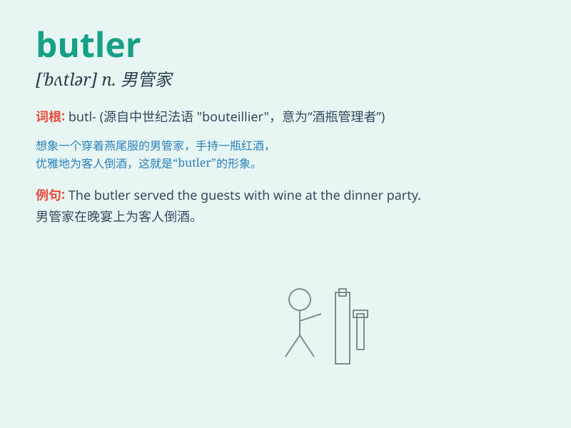

## butler

**英音:** _[\'bʌtlə]_ **美音:** _[\'bʌtlɚ]_

**译义:** *n.仆役长,男管家*

### 短语

+ **head butler:** _管家领班_

+ **butler service:** _管家服务_

+ **estate butler:** _庄园管家_

+ **hotel butler:** _酒店管家_

+ **private butler:** _私人管家_

### 例句

#### 例句1

> **The butler opened the door and greeted the guests politely.**

**中文翻译:** 管家打开门并礼貌地迎接客人。

**单词释义:** 管家

#### 例句2

> **The butler served the wine at the dinner party.**

**中文翻译:** 在晚宴上，管家倒酒。

**单词释义:** 管家

#### 例句3

> **The wealthy family relied on their experienced butler for many
years.**

**中文翻译:** 这个富裕的家庭多年来一直依靠他们经验丰富的管家。

**单词释义:** 管家

### 背诵小故事

> Once upon a time, there was a big house. The owner relied on a man
named Butler to manage everything. Butler was responsible for serving
meals and taking care of guests. He was the key person to keep the house
in order.

**从前，有一座大房子。主人依靠一个叫巴特勒的人来管理一切。巴特勒负责上菜和照顾客人。他是让房子保持井然有序的关键人物。**

### 图义

