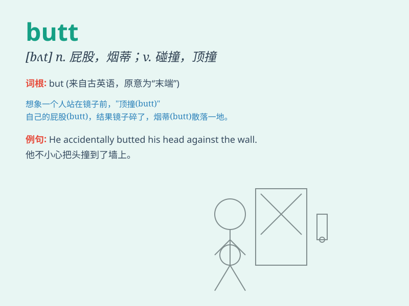

## butt

**英音:** _[bʌt]_ **美音:** _[bʌt]_

**译义:** *n.粗大的一端,靶垛,笑柄v.以头抵撞,碰撞*

### 短语

+ **butt in:** _插嘴；插手；干涉_

+ **butt out:** _别管闲事；走开_

+ **head and butt:** _头和屁股_

+ **butt joint:** _对接；对接接头_

+ **cigarette butt:** _烟蒂；烟头_

### 例句

#### 例句1

> **He accidentally hit his head on the butt of the chair.**

**中文翻译:** 他不小心把头撞在了椅子的底部。

**单词释义:** 底部；末端

#### 例句2

> **She gave him a butt on the shoulder to get his attention.**

**中文翻译:** 她在他肩膀上戳了一下以引起他的注意。

**单词释义:** 用头撞；顶撞

#### 例句3

> **The cigarette butt was still smoldering on the ground.**

**中文翻译:** 那个烟蒂仍在地上闷烧着。

**单词释义:** 烟蒂；烟头

### 背诵小故事

> A monkey was sitting on a tree branch, happily eating a banana.
Suddenly, it slipped and landed on its butt. Poor monkey! But it quickly
stood up and continued playing. The word \'butt\' means the part of the
body you sit on.

**一只猴子正坐在树枝上开心地吃着香蕉。突然，它滑了一下，摔到了屁股上。可怜的猴子！但它很快站起来继续玩耍。单词\'butt\'意思是身体上你坐的那个部位。**

### 图义

