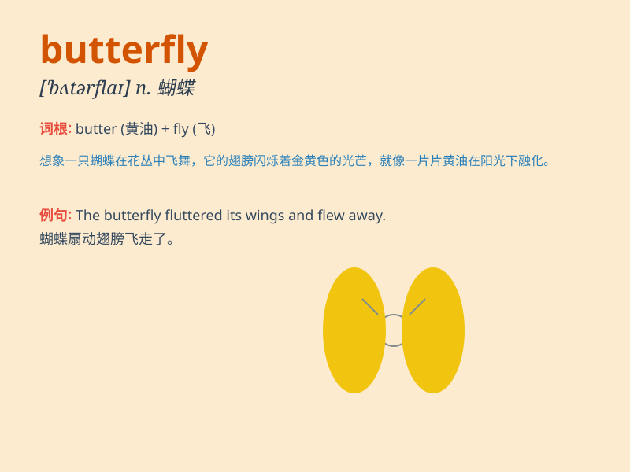

## butterfly

**英音:** _[\'bʌtəflaɪ]_ **美音:** _[\'bʌtɚflaɪ]_

**译义:** *n.[动]蝴蝶 蝶泳*

### 短语

+ **butterfly effect:**
_蝴蝶效应（指在一个动力系统中，初始条件下微小的变化能带动整个系统的长期的巨大的连锁反应）_

+ **social butterfly:** _交际花_

+ **butterfly stroke:** _蝶泳_

+ **butterfly valve:** _蝶阀_

+ **butterfly garden:** _蝴蝶园_

### 例句

#### 例句1

> **The butterfly fluttered its wings and flew away.**

**中文翻译:** 这只蝴蝶拍动着翅膀飞走了。

**单词释义:** 蝴蝶

#### 例句2

> **She wore a dress with butterfly patterns.**

**中文翻译:** 她穿了一条带有蝴蝶图案的连衣裙。

**单词释义:** 蝴蝶

#### 例句3

> **The child was chasing the butterfly in the garden.**

**中文翻译:** 这个孩子在花园里追逐蝴蝶。

**单词释义:** 蝴蝶

### 背诵小故事

> A girl was eating butter and suddenly a fly came. The butter stuck to
the fly\'s wings and it transformed into a beautiful butterfly. So,
remember, butter + fly = butterfly.

**一个女孩正在吃黄油，突然一只苍蝇飞来。黄油粘在了苍蝇的翅膀上，它就变成了一只美丽的蝴蝶。所以，记住，黄油+苍蝇=蝴蝶。**

### 图义

